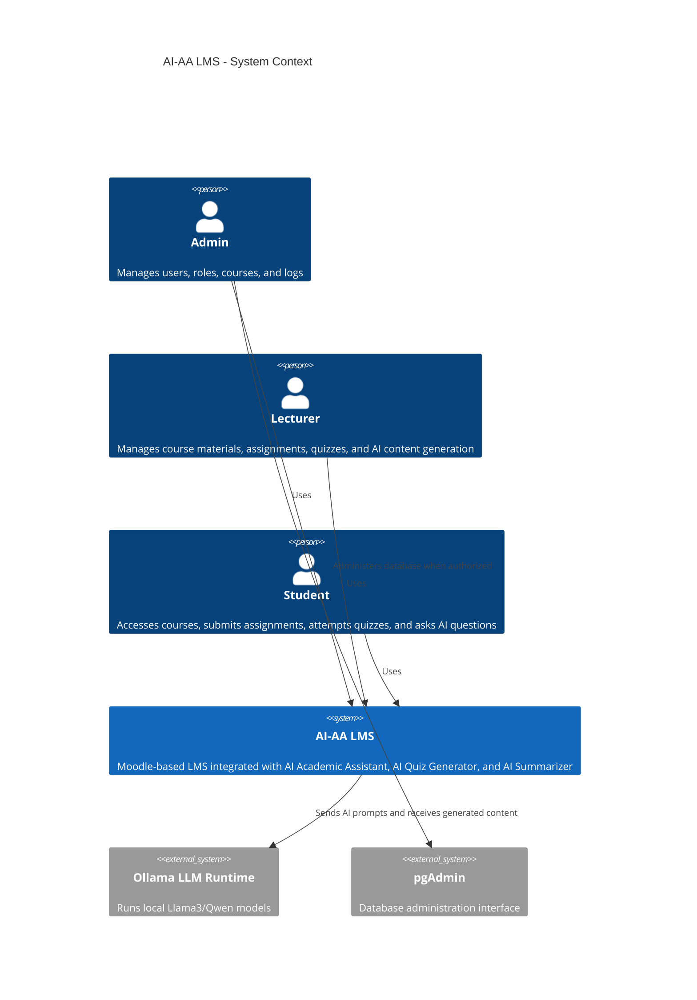
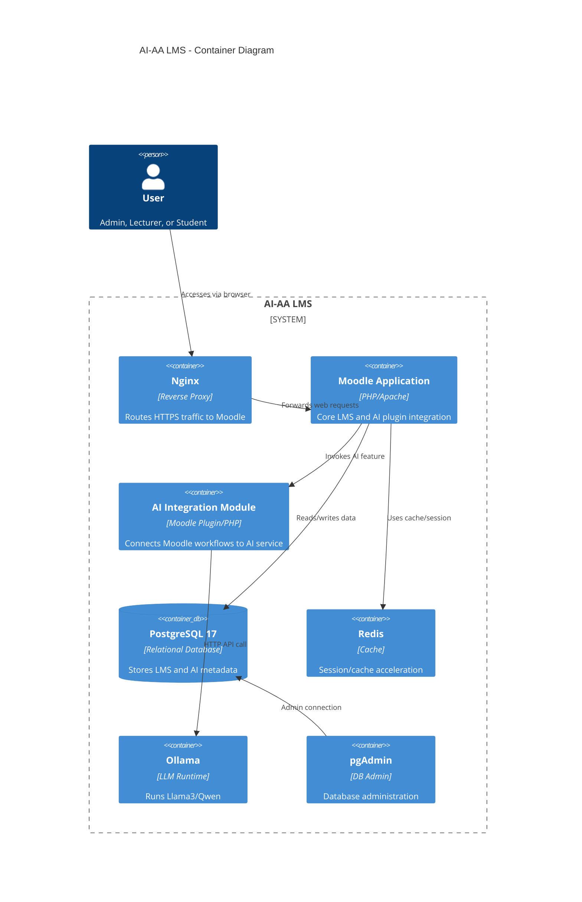
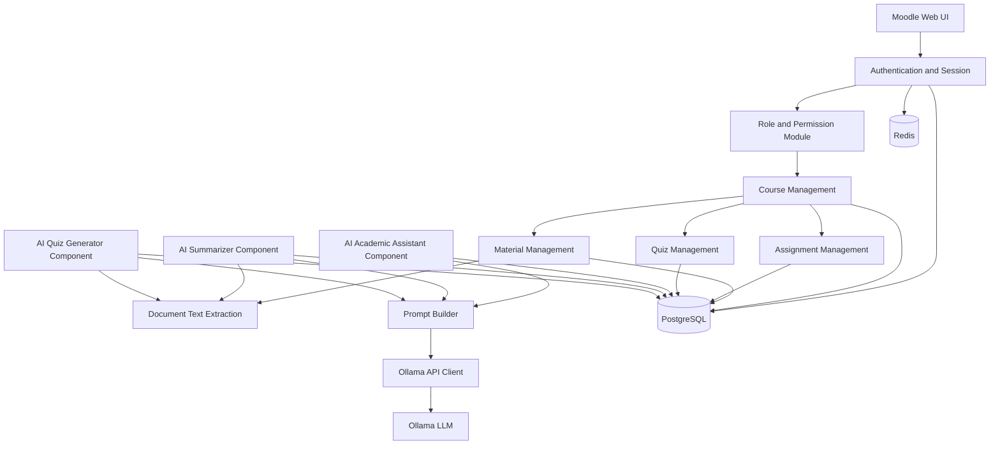
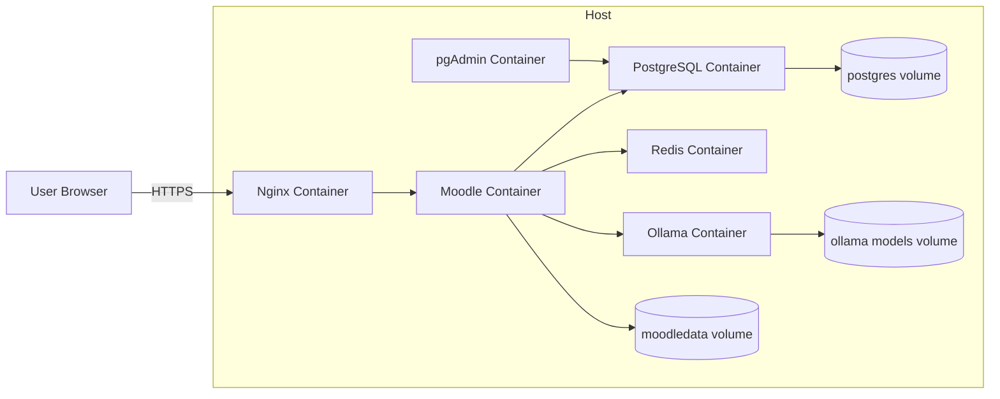
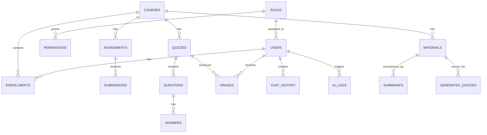

# Enterprise Software Documentation
# AI Academic Assistant Learning Management System (AI-AA LMS)

**Document Version:** 2.0  
**Base Document:** PRD v1 - AI Academic Assistant LMS  
**Project Type:** Proof of Concept and Enterprise Prototype  
**Core Platform:** Moodle 5.x, PHP, PostgreSQL 17, Docker, Ollama, Llama3/Qwen  
**Document Status:** Ready for Analysis, Design, and Implementation Planning  
**Prepared For:** Academic, Research, and Professional Software Development Use  
**Date:** July 2026

---

## Document Control

| Field | Value |
|---|---|
| Project Name | AI Academic Assistant Learning Management System |
| Short Name | AI-AA LMS |
| Version | 2.0 |
| Classification | Enterprise Software Documentation |
| Main Objective | Build PoC and prototype LMS integrated with AI academic assistance features |
| Primary Users | Admin, Lecturer, Student |
| Main Deliverable | Enterprise-grade analysis, architecture, design, backlog, and project planning documentation |

---

## Table of Contents

1. Product Requirements Document V2
2. Software Architecture Document
3. C4 System Diagrams
4. Database Design
5. API Design
6. Docker Architecture
7. DevOps Architecture
8. Sprint Roadmap
9. Implementation Backlog - Jira Style
10. Project Management Plan
11. Appendices

---

# PHASE 1 - PRODUCT REQUIREMENTS DOCUMENT (PRD V2)

## 1. Executive Summary

AI Academic Assistant Learning Management System (AI-AA LMS) is an enterprise-grade prototype and Proof of Concept that combines a traditional Moodle-based Learning Management System with Artificial Intelligence capabilities. The solution is designed to support academic activities through standard LMS features such as authentication, user management, course management, assignment management, and quiz management, while extending Moodle with AI-powered academic assistance, automatic quiz generation, and material summarization.

The system uses Moodle 5.x as the core LMS platform, PostgreSQL 17 as the main relational database, Docker Compose as the development and deployment orchestration layer, and Ollama as the local Large Language Model runtime. The target LLMs are Llama3 and Qwen. The project prioritizes a practical, implementable, and academically defensible architecture that can be used for research, thesis work, institutional PoC, or professional prototype development.

## 2. Vision

To build an intelligent learning platform that combines the structured learning management capabilities of Moodle with AI-driven academic support, enabling students to learn more effectively and lecturers to produce learning content more efficiently.

## 3. Mission

The mission of AI-AA LMS is to provide an integrated academic platform that:

- Helps students understand learning materials through an AI Academic Assistant.
- Helps lecturers generate quizzes from learning materials.
- Helps lecturers and students summarize learning materials into key concepts.
- Demonstrates how Moodle can be extended into an AI-enabled educational platform.
- Provides a structured PoC that can evolve into an enterprise-ready LMS solution.

## 4. Objectives

| Objective ID | Objective | Measurement |
|---|---|---|
| OBJ-01 | Deploy Moodle using Docker Compose | Moodle is accessible from browser and connected to PostgreSQL |
| OBJ-02 | Integrate Moodle with PostgreSQL 17 | Moodle data is persisted in PostgreSQL |
| OBJ-03 | Provide role-based user management | Admin, Lecturer, and Student roles are available |
| OBJ-04 | Implement AI Academic Assistant | Students can ask questions and receive AI responses |
| OBJ-05 | Implement AI Material Summarizer | Users can generate summaries from uploaded materials |
| OBJ-06 | Implement AI Quiz Generator | Lecturers can generate quiz questions from materials |
| OBJ-07 | Produce complete technical documentation | PRD, SAD, ERD, API design, Docker design, backlog, and project plan are available |

## 5. Business Value

| Business Value | Description |
|---|---|
| Academic Productivity | Reduces lecturer effort in quiz preparation and content summarization |
| Learning Support | Provides students with always-available academic assistance |
| Institutional Innovation | Demonstrates practical AI adoption in digital education |
| Cost Efficiency | Uses open-source technologies and local LLM runtime |
| Research Value | Provides a strong foundation for thesis, research, and prototype evaluation |
| Extensibility | Can be expanded into RAG, adaptive learning, analytics, and recommendation systems |

---

# Business Requirement Document (BRD)

## 6. Business Problem

Traditional LMS platforms focus on content delivery, submission management, and assessment workflows. However, they often do not provide intelligent support for students who need contextual explanations, summaries, or academic guidance. Lecturers also spend significant time creating quizzes, summarizing materials, and preparing assessment variations.

The lack of AI support creates several gaps:

- Students depend heavily on lecturer availability.
- Learning materials are not always easy to understand independently.
- Lecturers need repetitive manual effort to create quizzes.
- LMS platforms often store content but do not actively assist learning.
- Institutions need practical AI adoption models that are secure, affordable, and measurable.

## 7. Business Opportunity

AI-AA LMS addresses the opportunity to modernize LMS platforms through AI integration while retaining the stability of Moodle. By using a local LLM runtime such as Ollama, the prototype can demonstrate AI-powered learning support without depending entirely on external cloud AI APIs.

Opportunities include:

- AI-enhanced learning experience.
- Academic assistant chatbot for contextual support.
- Automated quiz generation based on uploaded course materials.
- Material summarization to accelerate comprehension.
- Enterprise architecture pattern for AI-enabled education systems.
- Foundation for future RAG-based institutional knowledge systems.

## 8. Success Criteria

| Category | Success Criteria | Target |
|---|---|---|
| Deployment | Moodle is deployed successfully using Docker Compose | 100 percent successful deployment |
| Database | PostgreSQL stores Moodle and AI extension data | All required tables operational |
| AI Chat | AI Academic Assistant responds to student questions | Response generated successfully |
| AI Summary | AI creates summaries from materials | Summary, key points, concepts generated |
| AI Quiz | AI generates quiz items | Minimum 10 questions per material |
| Security | RBAC and session controls work correctly | Unauthorized access blocked |
| Performance | Basic LMS pages respond acceptably | Target under 3 seconds for normal LMS pages |
| AI Performance | AI responses are acceptable for PoC | Chat under 10 seconds for small prompts, summary/quiz under 60 seconds depending material size |
| Documentation | Complete enterprise documentation produced | PRD, SAD, ERD, API, DevOps, backlog, PM plan |

---

# Product Scope

## 9. In Scope

### Standard LMS Scope

- User authentication.
- Login and logout.
- Session management.
- Role-based access control.
- Admin, Lecturer, and Student roles.
- User management.
- Course creation and management.
- Course enrollment.
- Learning material upload.
- Assignment creation.
- Assignment submission.
- Assignment grading.
- Quiz creation.
- Quiz attempt.
- Automatic quiz grading for objective questions.

### AI Scope

- AI Academic Assistant for student question answering.
- AI Material Summarizer for uploaded PDF, PPT, and text materials.
- AI Quiz Generator for multiple choice, essay, and true/false questions.
- AI request and response logging.
- AI prompt template management at basic implementation level.
- AI feature access controlled by role.

### Technical Scope

- Moodle 5.x deployment.
- PostgreSQL 17 database.
- Docker Compose setup.
- Ollama service integration.
- Llama3 and/or Qwen model runtime.
- pgAdmin for database administration.
- Redis for cache/session improvement.
- Nginx reverse proxy.
- Development, staging, and production architecture plan.

## 10. Out of Scope

| Out of Scope Item | Reason |
|---|---|
| Native mobile application | Not required for PoC |
| Video conferencing | Outside core AI LMS scope |
| AI grading for essays | Requires stricter evaluation and academic governance |
| Fine-tuned custom model | PoC uses existing local LLMs |
| Full RAG knowledge base | Future enhancement |
| Payment system | Not relevant to academic PoC |
| Multi-institution tenant isolation | Future enterprise scope |
| Voice assistant | Future enhancement |
| Advanced analytics dashboard | Future scope |
| High-availability Kubernetes deployment | Production evolution, not MVP |

## 11. Assumptions

- Moodle 5.x supports required LMS workflows.
- PostgreSQL 17 is selected as the primary relational database.
- AI model execution is performed locally using Ollama.
- Llama3 or Qwen is available in the Ollama environment.
- Uploaded materials can be extracted into text before being sent to the AI layer.
- Users access the system using a modern web browser.
- The first implementation is a PoC, not a fully certified production system.
- Internet access is not required for core AI inference after the model is downloaded.

## 12. Constraints

| Constraint Type | Constraint |
|---|---|
| Technical | Moodle plugin architecture must be respected |
| Technical | AI performance depends on server CPU/GPU and model size |
| Security | User data and uploaded materials must be protected |
| Academic | AI output must be treated as assistance, not absolute truth |
| Operational | Docker Compose is used for initial orchestration |
| Resource | Hardware may limit inference speed |
| Compliance | Audit logs are required for sensitive operations |
| Scope | PoC must focus on core LMS plus three AI features |

---

# Stakeholder Analysis

## 13. Stakeholder Matrix

| Stakeholder | Interest | Influence | Responsibility | Success Expectation |
|---|---:|---:|---|---|
| Project Owner | High | High | Defines vision, approves scope | Working PoC and complete documentation |
| Academic Supervisor | High | Medium | Reviews academic validity | Clear methodology and measurable outcomes |
| Admin | High | High | Operates system | Manage users, roles, courses, and settings |
| Lecturer | High | Medium | Creates content and assessments | Faster material and quiz preparation |
| Student | High | Medium | Uses learning features | Better understanding and faster learning support |
| Developer | High | High | Implements application | Clear requirements and architecture |
| DevOps Engineer | Medium | High | Deploys and monitors system | Reproducible deployment |
| Database Administrator | Medium | Medium | Maintains database | Reliable data storage and backup |
| Security Reviewer | Medium | Medium | Reviews controls | Safe authentication, authorization, and logging |

## 14. Responsibilities and Authority

| Role | Responsibilities | Authority |
|---|---|---|
| Project Owner | Define objectives, approve MVP, manage priorities | Final scope approval |
| Product Manager | Translate business needs into requirements | Backlog prioritization |
| Solution Architect | Define enterprise architecture | Architecture approval recommendation |
| Software Architect | Define application structure and integration | Technical design decision |
| Technical Lead | Guide implementation standards | Code and implementation review |
| DevOps Architect | Define environment, CI/CD, containerization | Deployment strategy decision |
| Database Architect | Define schema and data governance | Database design approval |
| Scrum Master | Facilitate agile delivery | Sprint process governance |
| QA Engineer | Validate functionality and acceptance criteria | Test sign-off recommendation |

---

# User Personas

## 15. Persona 1 - Admin

| Attribute | Description |
|---|---|
| Name | System Administrator |
| Age Range | 25-50 |
| Goal | Ensure LMS is configured, secure, and operational |
| Main Tasks | Manage users, roles, permissions, courses, configurations, logs |
| Pain Points | Manual administration, security concerns, lack of visibility |
| Success Criteria | System runs reliably and access is controlled correctly |

## 16. Persona 2 - Lecturer

| Attribute | Description |
|---|---|
| Name | Lecturer / Instructor |
| Age Range | 25-60 |
| Goal | Manage courses, learning materials, assignments, and quizzes efficiently |
| Main Tasks | Upload materials, create assignments, generate quizzes, review submissions |
| Pain Points | Time-consuming content preparation and assessment creation |
| Success Criteria | Faster quiz creation and better learning material preparation |

## 17. Persona 3 - Student

| Attribute | Description |
|---|---|
| Name | Student |
| Age Range | 18-25 |
| Goal | Learn efficiently and get help understanding materials |
| Main Tasks | Access courses, read materials, submit assignments, attempt quizzes, ask AI questions |
| Pain Points | Difficulty understanding topics without immediate lecturer support |
| Success Criteria | Receives helpful AI explanations and improves comprehension |

---

# User Journey Mapping

## 18. Admin Journey

| Stage | User Action | System Response | Pain Point | Improvement Opportunity |
|---|---|---|---|---|
| Access | Admin logs in | System authenticates and opens dashboard | Failed login risk | Clear login error and audit logging |
| Setup | Admin creates roles and users | System stores users and role mapping | Manual data input | Bulk upload future feature |
| Course Governance | Admin reviews courses | System lists courses and enrollments | Limited visibility | Dashboard enhancement |
| Monitoring | Admin checks logs | System displays audit and AI logs | Logs may be technical | Admin-friendly reporting |

## 19. Lecturer Journey

| Stage | User Action | System Response | Pain Point | Improvement Opportunity |
|---|---|---|---|---|
| Login | Lecturer logs in | Dashboard displayed | None | SSO future scope |
| Course Setup | Lecturer creates course | Course is created | Repetitive setup | Course template future scope |
| Material Upload | Lecturer uploads PDF/PPT/Text | Material stored | Text extraction may fail | File validation and extraction feedback |
| Quiz Generation | Lecturer requests AI quiz | AI generates question draft | AI may produce inaccurate output | Lecturer review and edit required |
| Assessment | Lecturer publishes quiz | Students can attempt quiz | Quality assurance needed | Question validation workflow |

## 20. Student Journey

| Stage | User Action | System Response | Pain Point | Improvement Opportunity |
|---|---|---|---|---|
| Login | Student logs in | Dashboard displayed | Credential issues | Password reset future scope |
| Course Access | Student opens enrolled course | Materials and activities displayed | Navigation confusion | Clear course layout |
| Learning | Student reads material | Material is shown | Difficult concepts | AI summarizer and AI assistant |
| AI Assistance | Student asks question | AI responds | Risk of hallucination | Disclaimer and source grounding future scope |
| Evaluation | Student attempts quiz | System grades objective questions | Feedback may be limited | AI feedback future scope |

---

# Functional Requirements

## 21. Functional Requirement Format

Each functional requirement uses the following structure:

- FR-ID
- Description
- Priority
- Actor
- Precondition
- Flow
- Acceptance Criteria

## 22. Functional Requirements List

### FR-001 - User Login

| Field | Description |
|---|---|
| FR-ID | FR-001 |
| Description | The system shall allow registered users to log in using valid credentials. |
| Priority | Must Have |
| Actor | Admin, Lecturer, Student |
| Precondition | User account exists and is active. |
| Flow | User opens login page; enters username/email and password; system validates credentials; system creates session; user is redirected to dashboard. |
| Acceptance Criteria | Valid users can log in; invalid users are rejected; login failures are logged; session is created after successful login. |

### FR-002 - User Logout

| Field | Description |
|---|---|
| FR-ID | FR-002 |
| Description | The system shall allow authenticated users to log out securely. |
| Priority | Must Have |
| Actor | Admin, Lecturer, Student |
| Precondition | User is authenticated. |
| Flow | User clicks logout; system invalidates session; user is redirected to login page. |
| Acceptance Criteria | Session is terminated; protected pages cannot be accessed after logout. |

### FR-003 - Session Management

| Field | Description |
|---|---|
| FR-ID | FR-003 |
| Description | The system shall manage user sessions securely with expiration and invalidation. |
| Priority | Must Have |
| Actor | System |
| Precondition | User is authenticated. |
| Flow | System creates session; session remains active during valid activity; session expires after configured timeout. |
| Acceptance Criteria | Expired sessions require re-login; session cookies use secure settings in production. |

### FR-004 - Role Management

| Field | Description |
|---|---|
| FR-ID | FR-004 |
| Description | The system shall support role management for Admin, Lecturer, and Student. |
| Priority | Must Have |
| Actor | Admin |
| Precondition | Admin is authenticated. |
| Flow | Admin opens role management; creates/updates roles; assigns permissions; saves changes. |
| Acceptance Criteria | Roles can be assigned; permissions restrict access correctly; unauthorized access is denied. |

### FR-005 - User Management

| Field | Description |
|---|---|
| FR-ID | FR-005 |
| Description | The system shall allow Admin to create, update, deactivate, and delete users. |
| Priority | Must Have |
| Actor | Admin |
| Precondition | Admin is authenticated and authorized. |
| Flow | Admin opens user management; enters user data; assigns role; system stores user record. |
| Acceptance Criteria | User record is created; required fields validated; duplicate email rejected; audit log created. |

### FR-006 - Course Creation

| Field | Description |
|---|---|
| FR-ID | FR-006 |
| Description | The system shall allow Admin or Lecturer to create courses. |
| Priority | Must Have |
| Actor | Admin, Lecturer |
| Precondition | User has course creation permission. |
| Flow | Actor opens course form; enters course information; submits form; system creates course. |
| Acceptance Criteria | Course appears in course list; mandatory fields are validated; creator is recorded. |

### FR-007 - Enrollment Management

| Field | Description |
|---|---|
| FR-ID | FR-007 |
| Description | The system shall allow authorized users to enroll students into courses. |
| Priority | Must Have |
| Actor | Admin, Lecturer |
| Precondition | Course and student accounts exist. |
| Flow | Actor opens enrollment page; selects students; assigns enrollment status; system stores enrollment. |
| Acceptance Criteria | Students can access enrolled courses only; enrollment changes are logged. |

### FR-008 - Material Upload

| Field | Description |
|---|---|
| FR-ID | FR-008 |
| Description | The system shall allow lecturers to upload learning materials in PDF, PPT, and text formats. |
| Priority | Must Have |
| Actor | Lecturer |
| Precondition | Lecturer owns or manages a course. |
| Flow | Lecturer opens course material page; uploads file; system validates file; system stores file metadata and path. |
| Acceptance Criteria | Supported files upload successfully; unsupported files are rejected; material is linked to the course. |

### FR-009 - Assignment Creation

| Field | Description |
|---|---|
| FR-ID | FR-009 |
| Description | The system shall allow lecturers to create assignments. |
| Priority | Must Have |
| Actor | Lecturer |
| Precondition | Lecturer manages a course. |
| Flow | Lecturer creates assignment with title, instruction, due date, and grading configuration. |
| Acceptance Criteria | Assignment appears to enrolled students; due date is enforced; assignment is editable by owner. |

### FR-010 - Assignment Submission

| Field | Description |
|---|---|
| FR-ID | FR-010 |
| Description | The system shall allow students to submit assignments. |
| Priority | Must Have |
| Actor | Student |
| Precondition | Student is enrolled in course and assignment is open. |
| Flow | Student opens assignment; uploads file or enters response; submits; system records submission. |
| Acceptance Criteria | Submission timestamp is recorded; student can view submitted status; late submission is marked if applicable. |

### FR-011 - Assignment Grading

| Field | Description |
|---|---|
| FR-ID | FR-011 |
| Description | The system shall allow lecturers to grade assignment submissions. |
| Priority | Should Have |
| Actor | Lecturer |
| Precondition | Submission exists. |
| Flow | Lecturer opens submission; enters grade and feedback; saves grade. |
| Acceptance Criteria | Grade is stored; student can view grade if released; grade is included in gradebook. |

### FR-012 - Quiz Creation

| Field | Description |
|---|---|
| FR-ID | FR-012 |
| Description | The system shall allow lecturers to create quizzes manually. |
| Priority | Must Have |
| Actor | Lecturer |
| Precondition | Lecturer manages a course. |
| Flow | Lecturer creates quiz; adds questions; defines schedule and grading settings; publishes quiz. |
| Acceptance Criteria | Quiz appears to enrolled students; quiz rules are applied; questions are stored. |

### FR-013 - Quiz Attempt

| Field | Description |
|---|---|
| FR-ID | FR-013 |
| Description | The system shall allow students to attempt published quizzes. |
| Priority | Must Have |
| Actor | Student |
| Precondition | Student is enrolled and quiz is available. |
| Flow | Student opens quiz; answers questions; submits attempt; system records answers. |
| Acceptance Criteria | Attempt is saved; objective answers are graded; submission time is recorded. |

### FR-014 - Automatic Quiz Grading

| Field | Description |
|---|---|
| FR-ID | FR-014 |
| Description | The system shall automatically grade objective quiz questions. |
| Priority | Must Have |
| Actor | System |
| Precondition | Quiz attempt is submitted. |
| Flow | System compares answers with correct answers; calculates score; stores grade. |
| Acceptance Criteria | Score is accurate for multiple choice and true/false; grade appears in gradebook. |

### FR-015 - AI Academic Assistant

| Field | Description |
|---|---|
| FR-ID | FR-015 |
| Description | The system shall allow students to ask academic questions and receive AI-generated responses. |
| Priority | Must Have |
| Actor | Student |
| Precondition | Student is authenticated and authorized to use AI feature. |
| Flow | Student opens AI assistant; enters question; Moodle sends request to AI service; AI service calls Ollama; response is returned and displayed. |
| Acceptance Criteria | AI response is displayed; question and response are logged; error message appears if AI service is unavailable. |

### FR-016 - AI Material Summarizer

| Field | Description |
|---|---|
| FR-ID | FR-016 |
| Description | The system shall generate summaries, key points, and important concepts from uploaded materials. |
| Priority | Must Have |
| Actor | Lecturer, Student where allowed |
| Precondition | Material exists and text can be extracted. |
| Flow | User selects material; requests summary; system extracts text; AI generates summary; summary is stored and displayed. |
| Acceptance Criteria | Summary includes summary text, key points, and concepts; generation status is tracked; summary is linked to material. |

### FR-017 - AI Quiz Generator

| Field | Description |
|---|---|
| FR-ID | FR-017 |
| Description | The system shall generate draft quiz questions from learning materials. |
| Priority | Must Have |
| Actor | Lecturer |
| Precondition | Lecturer has uploaded material and has quiz creation permission. |
| Flow | Lecturer selects material; chooses question type and number; AI generates questions; lecturer reviews and saves questions. |
| Acceptance Criteria | Multiple choice, essay, and true/false questions can be generated; lecturer must review before publishing; generated quiz is stored. |

### FR-018 - AI Logs

| Field | Description |
|---|---|
| FR-ID | FR-018 |
| Description | The system shall log AI requests, responses, model information, processing time, and status. |
| Priority | Should Have |
| Actor | System, Admin |
| Precondition | AI feature is used. |
| Flow | System records request metadata; stores response metadata; makes logs available to Admin. |
| Acceptance Criteria | Logs include user, feature, timestamp, status, latency, and model; sensitive content handling follows policy. |

### FR-019 - Audit Logging

| Field | Description |
|---|---|
| FR-ID | FR-019 |
| Description | The system shall record important security and business actions in audit logs. |
| Priority | Should Have |
| Actor | System |
| Precondition | Auditable action occurs. |
| Flow | System captures actor, action, entity, timestamp, and result. |
| Acceptance Criteria | Login, user changes, role changes, course changes, AI usage, and grading actions are logged. |

### FR-020 - AI Service Availability Handling

| Field | Description |
|---|---|
| FR-ID | FR-020 |
| Description | The system shall handle AI service unavailability gracefully. |
| Priority | Must Have |
| Actor | System |
| Precondition | AI service is unavailable, slow, or returns error. |
| Flow | User requests AI feature; service fails; system shows meaningful error and records failure. |
| Acceptance Criteria | No application crash; user receives clear error; failure is logged. |

---

# Non-Functional Requirements

## 23. NFR Matrix

| NFR-ID | Category | Requirement | Target |
|---|---|---|---|
| NFR-001 | Security | System shall enforce authentication for protected pages | 100 percent protected access |
| NFR-002 | Security | System shall enforce RBAC for Admin, Lecturer, Student | Unauthorized access denied |
| NFR-003 | Security | Input validation shall be applied to user and AI inputs | Invalid input rejected or sanitized |
| NFR-004 | Availability | PoC target availability | 99 percent during test window |
| NFR-005 | Performance | Normal LMS page response | Under 3 seconds under PoC load |
| NFR-006 | Performance | AI chat response | Under 10 seconds for small prompts, hardware dependent |
| NFR-007 | Performance | AI summary/quiz generation | Under 60 seconds for small to medium documents, hardware dependent |
| NFR-008 | Scalability | Services shall be containerized | Docker Compose supported |
| NFR-009 | Reliability | System shall handle AI service failure gracefully | No critical application failure |
| NFR-010 | Maintainability | AI features shall be modular | AI integration isolated from core LMS logic |
| NFR-011 | Portability | Deployment shall run on Docker-supported environments | Linux host recommended |
| NFR-012 | Observability | Logs shall be available for application and AI service | Admin/dev can inspect failures |
| NFR-013 | Backup | Database and Moodle data shall be backup-ready | Volume backup procedure defined |

---

# Use Case Specification

## 24. Use Case List

| Use Case ID | Use Case | Primary Actor | Priority |
|---|---|---|---|
| UC-001 | Login | Admin, Lecturer, Student | Must Have |
| UC-002 | Logout | Admin, Lecturer, Student | Must Have |
| UC-003 | Manage Users | Admin | Must Have |
| UC-004 | Manage Roles | Admin | Must Have |
| UC-005 | Create Course | Admin, Lecturer | Must Have |
| UC-006 | Enroll Student | Admin, Lecturer | Must Have |
| UC-007 | Upload Material | Lecturer | Must Have |
| UC-008 | Create Assignment | Lecturer | Must Have |
| UC-009 | Submit Assignment | Student | Must Have |
| UC-010 | Grade Assignment | Lecturer | Should Have |
| UC-011 | Create Quiz | Lecturer | Must Have |
| UC-012 | Attempt Quiz | Student | Must Have |
| UC-013 | Use AI Academic Assistant | Student | Must Have |
| UC-014 | Generate Material Summary | Lecturer, Student | Must Have |
| UC-015 | Generate Quiz with AI | Lecturer | Must Have |
| UC-016 | View AI Logs | Admin | Should Have |

## 25. Detailed Use Cases

### UC-001 - Login

| Field | Description |
|---|---|
| Primary Actor | Admin, Lecturer, Student |
| Goal | Access the LMS securely |
| Preconditions | User account exists and is active |
| Main Flow | User opens login page; enters credentials; system validates; dashboard opens |
| Alternate Flow | Invalid credentials show error; locked user is rejected |
| Postcondition | Authenticated session is created |

### UC-003 - Manage Users

| Field | Description |
|---|---|
| Primary Actor | Admin |
| Goal | Create and maintain user accounts |
| Preconditions | Admin is authenticated |
| Main Flow | Admin opens user management; creates/updates/deactivates user; assigns role; saves |
| Alternate Flow | Duplicate email or invalid data is rejected |
| Postcondition | User record is updated and audit log is created |

### UC-005 - Create Course

| Field | Description |
|---|---|
| Primary Actor | Admin, Lecturer |
| Goal | Create a course workspace |
| Preconditions | Actor has course creation permission |
| Main Flow | Actor enters course title, description, category, start date; system creates course |
| Alternate Flow | Missing required fields show validation errors |
| Postcondition | Course is available for enrollment and material upload |

### UC-007 - Upload Material

| Field | Description |
|---|---|
| Primary Actor | Lecturer |
| Goal | Add course learning material |
| Preconditions | Lecturer manages course |
| Main Flow | Lecturer selects file; system validates extension and size; file is stored; metadata saved |
| Alternate Flow | Unsupported file is rejected |
| Postcondition | Material is available in course |

### UC-013 - Use AI Academic Assistant

| Field | Description |
|---|---|
| Primary Actor | Student |
| Goal | Receive academic explanation from AI |
| Preconditions | Student is logged in and enrolled in course |
| Main Flow | Student opens AI Assistant; enters question; system forwards request to AI service; AI returns response; response shown |
| Alternate Flow | AI timeout returns friendly error |
| Postcondition | Chat history and AI log are stored |

### UC-014 - Generate Material Summary

| Field | Description |
|---|---|
| Primary Actor | Lecturer, Student if allowed |
| Goal | Generate concise summary from material |
| Preconditions | Material exists and text extraction succeeds |
| Main Flow | User selects material; requests summary; text is extracted; prompt sent to LLM; result is saved and displayed |
| Alternate Flow | Extraction failure returns error |
| Postcondition | Summary is stored and linked to material |

### UC-015 - Generate Quiz with AI

| Field | Description |
|---|---|
| Primary Actor | Lecturer |
| Goal | Generate draft quiz items from material |
| Preconditions | Lecturer manages course and material exists |
| Main Flow | Lecturer selects material and question settings; AI generates questions; lecturer reviews; questions saved as draft or quiz |
| Alternate Flow | AI output invalid; system asks lecturer to regenerate or edit manually |
| Postcondition | Generated quiz records are stored |

---

# User Stories

## 26. User Story Matrix

| Story ID | User Story | Acceptance Criteria | Priority | Story Points |
|---|---|---|---|---:|
| US-001 | As an admin, I want to manage users so that access can be controlled. | Admin can create, update, deactivate, and assign roles to users. | Must Have | 5 |
| US-002 | As an admin, I want to manage roles so that users only access allowed features. | Role permission mapping is enforced. | Must Have | 5 |
| US-003 | As a lecturer, I want to create courses so that I can organize learning activities. | Course can be created and viewed by enrolled students. | Must Have | 5 |
| US-004 | As a lecturer, I want to upload materials so that students can access learning resources. | PDF, PPT, and text files can be uploaded. | Must Have | 5 |
| US-005 | As a lecturer, I want to create assignments so that students can submit work. | Assignment has title, instruction, due date, and submission settings. | Must Have | 5 |
| US-006 | As a student, I want to submit assignments so that lecturers can evaluate my work. | Submission is saved with timestamp. | Must Have | 3 |
| US-007 | As a lecturer, I want to create quizzes so that I can assess students. | Quiz can contain multiple question types. | Must Have | 5 |
| US-008 | As a student, I want to attempt quizzes so that I can complete assessments. | Attempt and answers are saved. | Must Have | 5 |
| US-009 | As a student, I want to ask AI academic questions so that I can understand materials better. | AI returns an answer and saves chat history. | Must Have | 8 |
| US-010 | As a lecturer, I want AI to generate quiz questions so that I can save preparation time. | AI generates editable multiple choice, essay, and true/false questions. | Must Have | 8 |
| US-011 | As a student, I want to view material summaries so that I can identify key concepts quickly. | Summary contains key points and concepts. | Should Have | 5 |
| US-012 | As an admin, I want to view AI logs so that I can monitor usage and failures. | Logs show feature, user, timestamp, model, status, and latency. | Should Have | 5 |
| US-013 | As a lecturer, I want to review AI-generated questions before publishing so that academic quality is maintained. | Generated quiz must be approved before publishing. | Must Have | 5 |
| US-014 | As a system operator, I want services to run in Docker so that deployment is reproducible. | All required services start with Docker Compose. | Must Have | 8 |

---

# Feature Prioritization

## 27. MoSCoW Prioritization

| Category | Features |
|---|---|
| Must Have | Authentication, RBAC, user management, course management, enrollment, material upload, assignment, quiz, AI Academic Assistant, AI Summarizer, AI Quiz Generator, Docker Compose deployment |
| Should Have | AI logs dashboard, audit logs, Redis cache, Nginx reverse proxy, pgAdmin, basic monitoring |
| Could Have | Prompt template management, AI usage analytics, enhanced reporting, bulk user import |
| Won't Have for MVP | Mobile app, video conference, fine tuning, full RAG, AI essay grading, recommendation engine |

## 28. MVP Scope

MVP includes:

- Docker Compose deployment.
- Moodle connected to PostgreSQL.
- Admin, Lecturer, Student roles.
- Core LMS workflows: user, course, enrollment, material, assignment, quiz.
- AI Academic Assistant through Ollama.
- AI Material Summarizer for uploaded text-extractable materials.
- AI Quiz Generator with lecturer review.
- Basic logging and error handling.

## 29. Future Scope

Future releases may include:

- Retrieval-Augmented Generation using course materials.
- AI-powered adaptive learning recommendation.
- Essay grading support with rubric and human approval.
- Student learning analytics.
- Mobile application.
- SSO integration.
- Kubernetes deployment.
- Multi-tenant institution support.
- Vector database integration.

---

# Security Requirements

## 30. Authentication

- All protected modules require authenticated access.
- Passwords must be stored using Moodle-supported secure password hashing.
- Login failures must be rate-limited or monitored.
- Session must be created only after successful authentication.

## 31. Authorization and RBAC

- Admin can manage system-wide configuration, users, roles, and logs.
- Lecturer can manage assigned courses, materials, assignments, and quizzes.
- Student can access only enrolled courses and permitted AI features.
- AI Quiz Generator must be restricted to Lecturer and Admin.
- AI logs must be visible only to Admin or authorized technical roles.

## 32. Session Management

- Session timeout must be configured.
- Session cookies must use secure and HTTP-only flags in production.
- Logout must invalidate the session.
- Session fixation must be prevented.

## 33. Encryption

- HTTPS must be used in staging and production.
- Database credentials must not be committed to source control.
- Secrets must be stored using environment variables or secret management.
- Backups containing sensitive data must be protected.

## 34. Input Validation

- Validate file type, file size, and file extension.
- Sanitize user text input.
- Validate AI prompt input length.
- Protect against XSS and injection attacks.
- Restrict uploaded files to allowed MIME types.

## 35. Audit Logging

Audit logs should capture:

- Login success and failure.
- User creation and update.
- Role assignment.
- Course creation and update.
- Assignment and quiz changes.
- Grade updates.
- AI feature usage.
- AI service failures.

---

# Risk Assessment

## 36. Risk Matrix

| Risk ID | Category | Risk | Probability | Impact | Severity | Mitigation |
|---|---|---|---|---|---|---|
| R-001 | Technical | Moodle plugin integration complexity | Medium | High | High | Use Moodle plugin standards and isolate AI integration |
| R-002 | Technical | AI inference is slow on limited hardware | High | Medium | High | Use smaller models, streaming response, queue for long tasks |
| R-003 | Operational | Docker environment misconfiguration | Medium | Medium | Medium | Provide environment templates and healthchecks |
| R-004 | AI | LLM hallucination | High | High | Critical | Add disclaimer, lecturer review, future RAG grounding |
| R-005 | AI | Generated quiz quality is poor | Medium | High | High | Require lecturer review before publishing |
| R-006 | Security | Unauthorized AI data exposure | Medium | High | High | Apply RBAC and avoid exposing cross-course data |
| R-007 | Security | File upload attack | Medium | High | High | Validate MIME type, extension, size, and storage path |
| R-008 | Data | Database data loss | Low | High | High | Define backup and restore procedures |
| R-009 | Project | Scope creep | Medium | Medium | Medium | Lock MVP and defer future features |
| R-010 | Academic | AI answer accepted as absolute truth | Medium | High | High | Add academic disclaimer and lecturer validation policy |

---

# Success Metrics

## 37. KPI

| KPI | Target |
|---|---|
| Moodle deployment success | 100 percent |
| User login success rate | 95 percent or higher during test |
| Course creation success | 100 percent in acceptance test |
| Material upload success | 95 percent for supported files |
| AI chat response success | 90 percent or higher in test scenario |
| AI summary generation success | 90 percent or higher for supported files |
| AI quiz generation success | At least 10 valid draft questions per material |
| Lecturer productivity improvement | Qualitative improvement through user evaluation |
| Student satisfaction | 80 percent or higher in survey |

## 38. SLA and SLO

| Metric | SLA/SLO for PoC |
|---|---|
| LMS availability | 99 percent in controlled test environment |
| Normal page response | 95 percent under 3 seconds |
| AI chat small prompt response | 90 percent under 10 seconds depending hardware |
| AI generation failure handling | 100 percent graceful error handling |
| Backup execution | Daily in staging or production plan |
| Recovery objective | RPO 24 hours, RTO 4 hours for prototype environment |

---

# Release Strategy

## 39. MVP Release

MVP release focuses on proving end-to-end feasibility:

- Moodle deployed through Docker Compose.
- PostgreSQL connected and persistent.
- User roles configured.
- Course, material, assignment, and quiz flows available.
- AI assistant, summarizer, and quiz generator integrated.
- Basic logs available.

## 40. Beta Release

Beta release focuses on improving usability and reliability:

- Improved AI prompt templates.
- Better error handling and retry behavior.
- AI usage log dashboard.
- Test data and sample courses.
- Basic monitoring and backup scripts.
- User acceptance testing with lecturers and students.

## 41. Production Candidate

Production candidate focuses on hardening:

- HTTPS through Nginx.
- Secure environment configuration.
- Regular backup and restore procedure.
- Performance tuning.
- Security review.
- Operational runbook.
- Release notes and deployment checklist.

---

# PHASE 2 - SOFTWARE ARCHITECTURE DOCUMENT (SAD)

## 42. Architecture Overview

AI-AA LMS uses Moodle as the main LMS application and extends it through AI integration services. The architecture separates the LMS layer, database layer, AI runtime layer, cache layer, reverse proxy layer, and administration/monitoring layer. The PoC can be implemented with Docker Compose, while the architecture remains extensible to staging and production environments.

## 43. Architectural Principles

| Principle | Description |
|---|---|
| Modularity | AI capabilities should be isolated from Moodle core code where possible |
| Reusability | AI service interfaces should be reusable for chat, summary, and quiz generation |
| Security by Design | RBAC, validation, audit logging, and secret protection are mandatory |
| Local AI First | Ollama is used to reduce dependency on external AI APIs |
| Observability | Logs and healthchecks are required for troubleshooting |
| Human-in-the-Loop | AI-generated quizzes must be reviewed by lecturers before publication |
| Portability | Docker Compose enables reproducible deployment |
| Maintainability | Configuration must be externalized through environment variables |

---

# C4 Model Architecture

## 44. Context Diagram



## 45. Container Diagram



## 46. Component Diagram



## 47. Deployment Diagram



---

# System Architecture

## 48. Application Architecture

The application architecture is centered on Moodle. Moodle provides the main user interface, authentication, authorization, course management, assignment, quiz, and gradebook capabilities. AI functions should be implemented as a Moodle local plugin or integration module to avoid modifying Moodle core.

Recommended application structure:

- Moodle Core: Existing LMS functions.
- AI Local Plugin: Handles AI pages, permissions, forms, controllers, and service calls.
- AI Service Client: Encapsulates Ollama API communication.
- Document Extraction Layer: Extracts text from PDF/PPT/Text before AI processing.
- Persistence Layer: Stores AI logs, chat history, summaries, and generated quizzes.

## 49. AI Architecture

AI architecture follows a request-processing pipeline:

```text
User Request -> Moodle AI Plugin -> Input Validation -> Context Builder -> Prompt Builder -> Ollama Client -> LLM Model -> Response Parser -> Persistence -> UI Response
```

AI components:

| Component | Responsibility |
|---|---|
| Input Validator | Validates prompt length, file type, and user permission |
| Text Extractor | Converts PDF/PPT/Text material into text chunks |
| Prompt Builder | Creates structured prompts for chat, summary, or quiz generation |
| Ollama Client | Sends HTTP request to Ollama API |
| Response Parser | Parses AI output into displayable or storable format |
| AI Logger | Records usage, model, latency, status, and errors |
| Review Workflow | Requires lecturer review before generated quiz is published |

## 50. Integration Architecture

| Integration | Protocol | Direction | Purpose |
|---|---|---|---|
| Browser to Nginx | HTTPS | User to system | Secure web access |
| Nginx to Moodle | HTTP internal | Reverse proxy to application | Request routing |
| Moodle to PostgreSQL | TCP | Application to DB | Data persistence |
| Moodle to Redis | TCP | Application to cache | Cache/session optimization |
| Moodle AI Plugin to Ollama | HTTP API | Application to AI runtime | LLM inference |
| pgAdmin to PostgreSQL | TCP | Admin tool to DB | Database administration |

## 51. Database Architecture

The database architecture includes Moodle standard tables and custom AI extension tables. Because Moodle already has its own schema, the physical AI extension tables should either use Moodle plugin naming conventions or be mapped carefully to avoid conflict.

Main AI-related data areas:

- Chat history.
- AI logs.
- Material summaries.
- Generated quiz drafts.
- Extracted material text metadata.
- Audit logs.

## 52. Security Architecture

Security controls include:

- Moodle authentication.
- Moodle capability-based authorization.
- RBAC using Admin, Lecturer, Student roles.
- Secure session configuration.
- HTTPS termination at Nginx.
- Environment variable based secret management.
- Input validation and file validation.
- Audit logging.
- AI access governance.

## 53. Deployment Architecture

Development deployment uses Docker Compose. Staging should mirror production as closely as possible with environment-specific variables. Production candidate should use Nginx reverse proxy with HTTPS, persistent volumes, backup routines, and restricted admin access.

## 54. Scalability Architecture

For PoC, services run on a single Docker host. Future scalability options:

- Move PostgreSQL to managed or dedicated DB server.
- Use Redis for session and cache.
- Use queue workers for long AI generation tasks.
- Split AI service onto GPU-enabled host.
- Use horizontal scaling for Moodle web containers.
- Use object storage for uploaded materials.
- Use Kubernetes for enterprise production deployment.

## 55. Monitoring Architecture

PoC monitoring:

- Docker container healthchecks.
- Moodle logs.
- PostgreSQL logs.
- Nginx access/error logs.
- Ollama service logs.
- AI request logs in database.

Future monitoring:

- Prometheus metrics.
- Grafana dashboards.
- Loki or ELK log aggregation.
- Alertmanager notifications.
- AI latency and token usage dashboards.

## 56. Backup Architecture

Backup targets:

- PostgreSQL database volume.
- Moodle data volume.
- Moodle configuration.
- AI extension data.
- Ollama model volume if required.

Recommended backup strategy:

| Item | Frequency | Retention |
|---|---|---|
| PostgreSQL dump | Daily | 7 daily, 4 weekly |
| Moodle data volume | Daily | 7 daily, 4 weekly |
| Configuration files | On change | Last 10 versions |
| AI logs | Daily | According to retention policy |

## 57. Disaster Recovery

| Scenario | Recovery Action | Target |
|---|---|---|
| Database corruption | Restore latest PostgreSQL backup | RTO 4 hours |
| Moodle data loss | Restore Moodle data volume backup | RTO 4 hours |
| AI service failure | Restart Ollama container or switch model | RTO 1 hour |
| Docker host failure | Rebuild from compose file and restore volumes | RTO 8 hours |
| Misconfiguration | Roll back environment/config version | RTO 2 hours |

---

# PHASE 3 - SYSTEM CONTEXT DIAGRAM

## 58. Context Diagram - Text View

```text
Admin / Lecturer / Student
        |
        v
AI-AA LMS - Moodle Web Application
        |
        +--> PostgreSQL 17 - LMS and AI data
        +--> Redis - cache/session
        +--> Ollama - local LLM runtime
        +--> pgAdmin - database administration
```

## 59. Container Diagram - Text View

```text
[Browser]
   |
[Nginx Reverse Proxy]
   |
[Moodle PHP Application]
   |-- [PostgreSQL 17]
   |-- [Redis]
   |-- [Ollama]
   |-- [Moodle Data Volume]

[pgAdmin] --> [PostgreSQL 17]
```

## 60. Component Diagram - Text View

```text
Moodle UI
  -> Authentication
  -> RBAC
  -> Course Module
  -> Material Module
  -> Assignment Module
  -> Quiz Module
  -> AI Plugin
       -> AI Chat Component
       -> AI Summary Component
       -> AI Quiz Generator Component
       -> Prompt Builder
       -> Ollama Client
       -> AI Logger
```

## 61. Deployment Diagram - Text View

```text
Docker Host
  - nginx container
  - moodle container
  - postgres container
  - redis container
  - ollama container
  - pgadmin container
  - persistent volumes
  - internal docker network
  - public web network
```

---

# PHASE 4 - DATABASE DESIGN

## 62. Database Design Approach

The database design below defines a logical enterprise schema for AI-AA LMS. Moodle has an existing schema; therefore, actual implementation should either:

1. Use Moodle standard tables for LMS features and custom plugin tables for AI features, or
2. Use this design as a conceptual and logical reference for documentation, analysis, and academic modeling.

## 63. Conceptual ERD



## 64. Logical Entity Design

### users

| Attribute | Type | Key | Description |
|---|---|---|---|
| id | bigint | PK | Unique user identifier |
| role_id | bigint | FK | Assigned role |
| username | varchar(100) | Unique | Login username |
| email | varchar(255) | Unique | User email |
| password_hash | varchar(255) |  | Secure password hash |
| full_name | varchar(255) |  | User full name |
| status | varchar(20) |  | active, inactive, suspended |
| created_at | timestamp |  | Creation timestamp |
| updated_at | timestamp |  | Update timestamp |

### roles

| Attribute | Type | Key | Description |
|---|---|---|---|
| id | bigint | PK | Role ID |
| name | varchar(50) | Unique | admin, lecturer, student |
| description | text |  | Role description |
| created_at | timestamp |  | Creation timestamp |

### permissions

| Attribute | Type | Key | Description |
|---|---|---|---|
| id | bigint | PK | Permission ID |
| role_id | bigint | FK | Related role |
| permission_code | varchar(100) |  | Permission identifier |
| description | text |  | Permission description |

### courses

| Attribute | Type | Key | Description |
|---|---|---|---|
| id | bigint | PK | Course ID |
| lecturer_id | bigint | FK users.id | Course owner |
| course_code | varchar(50) | Unique | Course code |
| title | varchar(255) |  | Course title |
| description | text |  | Course description |
| status | varchar(20) |  | draft, active, archived |
| created_at | timestamp |  | Creation timestamp |
| updated_at | timestamp |  | Update timestamp |

### enrollments

| Attribute | Type | Key | Description |
|---|---|---|---|
| id | bigint | PK | Enrollment ID |
| course_id | bigint | FK | Course |
| user_id | bigint | FK | Student or lecturer participant |
| enrollment_role | varchar(30) |  | student, lecturer, assistant |
| status | varchar(20) |  | active, completed, dropped |
| enrolled_at | timestamp |  | Enrollment timestamp |

### materials

| Attribute | Type | Key | Description |
|---|---|---|---|
| id | bigint | PK | Material ID |
| course_id | bigint | FK | Course |
| uploaded_by | bigint | FK users.id | Uploader |
| title | varchar(255) |  | Material title |
| file_type | varchar(20) |  | pdf, ppt, text |
| file_path | text |  | Storage path |
| extracted_text_path | text |  | Optional extracted text path |
| status | varchar(20) |  | active, processing, failed |
| uploaded_at | timestamp |  | Upload time |

### assignments

| Attribute | Type | Key | Description |
|---|---|---|---|
| id | bigint | PK | Assignment ID |
| course_id | bigint | FK | Course |
| created_by | bigint | FK users.id | Lecturer |
| title | varchar(255) |  | Assignment title |
| instruction | text |  | Assignment instruction |
| due_date | timestamp |  | Due date |
| max_score | numeric(5,2) |  | Maximum score |
| status | varchar(20) |  | draft, published, closed |
| created_at | timestamp |  | Creation timestamp |

### submissions

| Attribute | Type | Key | Description |
|---|---|---|---|
| id | bigint | PK | Submission ID |
| assignment_id | bigint | FK | Assignment |
| student_id | bigint | FK users.id | Student |
| content | text |  | Text submission |
| file_path | text |  | File submission |
| submitted_at | timestamp |  | Submission time |
| status | varchar(20) |  | submitted, late, graded |

### quizzes

| Attribute | Type | Key | Description |
|---|---|---|---|
| id | bigint | PK | Quiz ID |
| course_id | bigint | FK | Course |
| created_by | bigint | FK users.id | Lecturer |
| title | varchar(255) |  | Quiz title |
| description | text |  | Quiz description |
| start_time | timestamp |  | Availability start |
| end_time | timestamp |  | Availability end |
| status | varchar(20) |  | draft, published, closed |
| created_at | timestamp |  | Creation timestamp |

### questions

| Attribute | Type | Key | Description |
|---|---|---|---|
| id | bigint | PK | Question ID |
| quiz_id | bigint | FK | Quiz |
| question_type | varchar(30) |  | multiple_choice, essay, true_false |
| question_text | text |  | Question text |
| correct_answer | text |  | Correct answer for objective question |
| score | numeric(5,2) |  | Question score |
| source | varchar(30) |  | manual, ai_generated |
| created_at | timestamp |  | Creation timestamp |

### answers

| Attribute | Type | Key | Description |
|---|---|---|---|
| id | bigint | PK | Answer ID |
| question_id | bigint | FK | Question |
| answer_text | text |  | Answer option or response |
| is_correct | boolean |  | Correct flag for objective answers |
| sort_order | int |  | Display order |

### grades

| Attribute | Type | Key | Description |
|---|---|---|---|
| id | bigint | PK | Grade ID |
| user_id | bigint | FK users.id | Student |
| course_id | bigint | FK courses.id | Course |
| quiz_id | bigint | FK quizzes.id nullable | Related quiz |
| assignment_id | bigint | FK assignments.id nullable | Related assignment |
| score | numeric(5,2) |  | Score |
| feedback | text |  | Lecturer feedback |
| graded_by | bigint | FK users.id nullable | Grader |
| graded_at | timestamp |  | Grading time |

### chat_history

| Attribute | Type | Key | Description |
|---|---|---|---|
| id | bigint | PK | Chat history ID |
| user_id | bigint | FK users.id | Student |
| course_id | bigint | FK courses.id nullable | Course context |
| question | text |  | User question |
| response | text |  | AI response |
| model_name | varchar(100) |  | LLM model used |
| created_at | timestamp |  | Timestamp |

### ai_logs

| Attribute | Type | Key | Description |
|---|---|---|---|
| id | bigint | PK | AI log ID |
| user_id | bigint | FK users.id | Requesting user |
| feature_type | varchar(50) |  | chat, summary, quiz_generation |
| model_name | varchar(100) |  | Model used |
| prompt_tokens_est | int |  | Estimated prompt tokens |
| response_tokens_est | int |  | Estimated response tokens |
| latency_ms | int |  | Processing time |
| status | varchar(20) |  | success, failed, timeout |
| error_message | text |  | Error detail |
| created_at | timestamp |  | Timestamp |

### summaries

| Attribute | Type | Key | Description |
|---|---|---|---|
| id | bigint | PK | Summary ID |
| material_id | bigint | FK materials.id | Source material |
| generated_by | bigint | FK users.id | User |
| summary_text | text |  | Summary |
| key_points | jsonb |  | Key points |
| important_concepts | jsonb |  | Important concepts |
| model_name | varchar(100) |  | Model used |
| created_at | timestamp |  | Timestamp |

### generated_quizzes

| Attribute | Type | Key | Description |
|---|---|---|---|
| id | bigint | PK | Generated quiz ID |
| material_id | bigint | FK materials.id | Source material |
| generated_by | bigint | FK users.id | Lecturer |
| generated_content | jsonb |  | AI-generated question set |
| question_count | int |  | Number of generated questions |
| status | varchar(20) |  | draft, reviewed, published, rejected |
| target_quiz_id | bigint | FK quizzes.id nullable | Published quiz |
| model_name | varchar(100) |  | Model used |
| created_at | timestamp |  | Timestamp |

### audit_logs

| Attribute | Type | Key | Description |
|---|---|---|---|
| id | bigint | PK | Audit log ID |
| actor_user_id | bigint | FK users.id | Actor |
| action | varchar(100) |  | Action name |
| entity_type | varchar(100) |  | Entity type |
| entity_id | bigint |  | Entity ID |
| old_value | jsonb |  | Previous data |
| new_value | jsonb |  | New data |
| ip_address | varchar(50) |  | Source IP |
| user_agent | text |  | Browser/device info |
| created_at | timestamp |  | Timestamp |

## 65. Physical ERD - PostgreSQL DDL Reference

```sql
CREATE TABLE roles (
  id BIGSERIAL PRIMARY KEY,
  name VARCHAR(50) UNIQUE NOT NULL,
  description TEXT,
  created_at TIMESTAMP NOT NULL DEFAULT CURRENT_TIMESTAMP
);

CREATE TABLE users (
  id BIGSERIAL PRIMARY KEY,
  role_id BIGINT NOT NULL REFERENCES roles(id),
  username VARCHAR(100) UNIQUE NOT NULL,
  email VARCHAR(255) UNIQUE NOT NULL,
  password_hash VARCHAR(255) NOT NULL,
  full_name VARCHAR(255) NOT NULL,
  status VARCHAR(20) NOT NULL DEFAULT 'active',
  created_at TIMESTAMP NOT NULL DEFAULT CURRENT_TIMESTAMP,
  updated_at TIMESTAMP NOT NULL DEFAULT CURRENT_TIMESTAMP
);

CREATE TABLE permissions (
  id BIGSERIAL PRIMARY KEY,
  role_id BIGINT NOT NULL REFERENCES roles(id),
  permission_code VARCHAR(100) NOT NULL,
  description TEXT,
  UNIQUE(role_id, permission_code)
);

CREATE TABLE courses (
  id BIGSERIAL PRIMARY KEY,
  lecturer_id BIGINT NOT NULL REFERENCES users(id),
  course_code VARCHAR(50) UNIQUE NOT NULL,
  title VARCHAR(255) NOT NULL,
  description TEXT,
  status VARCHAR(20) NOT NULL DEFAULT 'draft',
  created_at TIMESTAMP NOT NULL DEFAULT CURRENT_TIMESTAMP,
  updated_at TIMESTAMP NOT NULL DEFAULT CURRENT_TIMESTAMP
);

CREATE TABLE enrollments (
  id BIGSERIAL PRIMARY KEY,
  course_id BIGINT NOT NULL REFERENCES courses(id) ON DELETE CASCADE,
  user_id BIGINT NOT NULL REFERENCES users(id) ON DELETE CASCADE,
  enrollment_role VARCHAR(30) NOT NULL DEFAULT 'student',
  status VARCHAR(20) NOT NULL DEFAULT 'active',
  enrolled_at TIMESTAMP NOT NULL DEFAULT CURRENT_TIMESTAMP,
  UNIQUE(course_id, user_id)
);

CREATE TABLE materials (
  id BIGSERIAL PRIMARY KEY,
  course_id BIGINT NOT NULL REFERENCES courses(id) ON DELETE CASCADE,
  uploaded_by BIGINT NOT NULL REFERENCES users(id),
  title VARCHAR(255) NOT NULL,
  file_type VARCHAR(20) NOT NULL,
  file_path TEXT NOT NULL,
  extracted_text_path TEXT,
  status VARCHAR(20) NOT NULL DEFAULT 'active',
  uploaded_at TIMESTAMP NOT NULL DEFAULT CURRENT_TIMESTAMP
);

CREATE TABLE assignments (
  id BIGSERIAL PRIMARY KEY,
  course_id BIGINT NOT NULL REFERENCES courses(id) ON DELETE CASCADE,
  created_by BIGINT NOT NULL REFERENCES users(id),
  title VARCHAR(255) NOT NULL,
  instruction TEXT,
  due_date TIMESTAMP,
  max_score NUMERIC(5,2) NOT NULL DEFAULT 100,
  status VARCHAR(20) NOT NULL DEFAULT 'draft',
  created_at TIMESTAMP NOT NULL DEFAULT CURRENT_TIMESTAMP
);

CREATE TABLE submissions (
  id BIGSERIAL PRIMARY KEY,
  assignment_id BIGINT NOT NULL REFERENCES assignments(id) ON DELETE CASCADE,
  student_id BIGINT NOT NULL REFERENCES users(id),
  content TEXT,
  file_path TEXT,
  submitted_at TIMESTAMP NOT NULL DEFAULT CURRENT_TIMESTAMP,
  status VARCHAR(20) NOT NULL DEFAULT 'submitted',
  UNIQUE(assignment_id, student_id)
);

CREATE TABLE quizzes (
  id BIGSERIAL PRIMARY KEY,
  course_id BIGINT NOT NULL REFERENCES courses(id) ON DELETE CASCADE,
  created_by BIGINT NOT NULL REFERENCES users(id),
  title VARCHAR(255) NOT NULL,
  description TEXT,
  start_time TIMESTAMP,
  end_time TIMESTAMP,
  status VARCHAR(20) NOT NULL DEFAULT 'draft',
  created_at TIMESTAMP NOT NULL DEFAULT CURRENT_TIMESTAMP
);

CREATE TABLE questions (
  id BIGSERIAL PRIMARY KEY,
  quiz_id BIGINT NOT NULL REFERENCES quizzes(id) ON DELETE CASCADE,
  question_type VARCHAR(30) NOT NULL,
  question_text TEXT NOT NULL,
  correct_answer TEXT,
  score NUMERIC(5,2) NOT NULL DEFAULT 1,
  source VARCHAR(30) NOT NULL DEFAULT 'manual',
  created_at TIMESTAMP NOT NULL DEFAULT CURRENT_TIMESTAMP
);

CREATE TABLE answers (
  id BIGSERIAL PRIMARY KEY,
  question_id BIGINT NOT NULL REFERENCES questions(id) ON DELETE CASCADE,
  answer_text TEXT NOT NULL,
  is_correct BOOLEAN NOT NULL DEFAULT FALSE,
  sort_order INT NOT NULL DEFAULT 0
);

CREATE TABLE grades (
  id BIGSERIAL PRIMARY KEY,
  user_id BIGINT NOT NULL REFERENCES users(id),
  course_id BIGINT NOT NULL REFERENCES courses(id),
  quiz_id BIGINT REFERENCES quizzes(id),
  assignment_id BIGINT REFERENCES assignments(id),
  score NUMERIC(5,2) NOT NULL,
  feedback TEXT,
  graded_by BIGINT REFERENCES users(id),
  graded_at TIMESTAMP NOT NULL DEFAULT CURRENT_TIMESTAMP
);

CREATE TABLE chat_history (
  id BIGSERIAL PRIMARY KEY,
  user_id BIGINT NOT NULL REFERENCES users(id),
  course_id BIGINT REFERENCES courses(id),
  question TEXT NOT NULL,
  response TEXT NOT NULL,
  model_name VARCHAR(100),
  created_at TIMESTAMP NOT NULL DEFAULT CURRENT_TIMESTAMP
);

CREATE TABLE ai_logs (
  id BIGSERIAL PRIMARY KEY,
  user_id BIGINT REFERENCES users(id),
  feature_type VARCHAR(50) NOT NULL,
  model_name VARCHAR(100),
  prompt_tokens_est INT,
  response_tokens_est INT,
  latency_ms INT,
  status VARCHAR(20) NOT NULL,
  error_message TEXT,
  created_at TIMESTAMP NOT NULL DEFAULT CURRENT_TIMESTAMP
);

CREATE TABLE summaries (
  id BIGSERIAL PRIMARY KEY,
  material_id BIGINT NOT NULL REFERENCES materials(id) ON DELETE CASCADE,
  generated_by BIGINT NOT NULL REFERENCES users(id),
  summary_text TEXT NOT NULL,
  key_points JSONB,
  important_concepts JSONB,
  model_name VARCHAR(100),
  created_at TIMESTAMP NOT NULL DEFAULT CURRENT_TIMESTAMP
);

CREATE TABLE generated_quizzes (
  id BIGSERIAL PRIMARY KEY,
  material_id BIGINT NOT NULL REFERENCES materials(id) ON DELETE CASCADE,
  generated_by BIGINT NOT NULL REFERENCES users(id),
  generated_content JSONB NOT NULL,
  question_count INT NOT NULL DEFAULT 0,
  status VARCHAR(20) NOT NULL DEFAULT 'draft',
  target_quiz_id BIGINT REFERENCES quizzes(id),
  model_name VARCHAR(100),
  created_at TIMESTAMP NOT NULL DEFAULT CURRENT_TIMESTAMP
);

CREATE TABLE audit_logs (
  id BIGSERIAL PRIMARY KEY,
  actor_user_id BIGINT REFERENCES users(id),
  action VARCHAR(100) NOT NULL,
  entity_type VARCHAR(100),
  entity_id BIGINT,
  old_value JSONB,
  new_value JSONB,
  ip_address VARCHAR(50),
  user_agent TEXT,
  created_at TIMESTAMP NOT NULL DEFAULT CURRENT_TIMESTAMP
);
```

## 66. Indexing Strategy

| Table | Index | Purpose |
|---|---|---|
| users | username, email | Fast login and uniqueness |
| users | role_id | Role filtering |
| courses | course_code | Course lookup |
| enrollments | course_id, user_id | Enrollment access check |
| materials | course_id | Course material listing |
| assignments | course_id | Course assignment listing |
| submissions | assignment_id, student_id | Submission lookup |
| quizzes | course_id | Course quiz listing |
| questions | quiz_id | Quiz rendering |
| grades | user_id, course_id | Student grade report |
| chat_history | user_id, course_id, created_at | Chat history retrieval |
| ai_logs | feature_type, status, created_at | Monitoring and troubleshooting |
| summaries | material_id | Summary lookup |
| generated_quizzes | material_id, status | AI quiz review workflow |
| audit_logs | actor_user_id, action, created_at | Audit investigation |

## 67. Constraints

- `users.email` must be unique.
- `users.username` must be unique.
- `roles.name` must be unique.
- `courses.course_code` must be unique.
- `enrollments.course_id + user_id` must be unique.
- `submissions.assignment_id + student_id` must be unique for single-submission assignment type.
- File type must be limited to configured allowed types.
- AI generated quizzes must remain draft until reviewed.

## 68. Audit Tables

Primary audit table: `audit_logs`.

Additional AI-specific operational audit: `ai_logs`.

Recommended audit events:

- User login success/failure.
- User profile or role update.
- Course creation/update/delete.
- Material upload/delete.
- Assignment creation/update/grading.
- Quiz creation/update/publish.
- AI chat request.
- AI summary generation.
- AI quiz generation.
- AI failure or timeout.

---

# PHASE 5 - API DESIGN

## 69. API Design Principles

Although Moodle is primarily a web application, AI-AA LMS should expose or internally define service APIs for modularity and future integration. APIs may be implemented as Moodle web services, plugin endpoints, or internal service classes.

Common API rules:

- Use JSON request and response format for AI services.
- All protected endpoints require authentication.
- Role-specific endpoints require authorization.
- Errors must use consistent codes and messages.
- AI requests must be logged.

## 70. Common Error Codes

| Code | Description |
|---|---|
| 400 | Bad request or validation error |
| 401 | Authentication required |
| 403 | Access denied |
| 404 | Resource not found |
| 409 | Conflict or duplicate resource |
| 413 | File or prompt too large |
| 422 | Unsupported file or unprocessable input |
| 429 | Too many requests |
| 500 | Internal server error |
| 502 | AI service error |
| 504 | AI service timeout |

## 71. Authentication API

### POST /api/auth/login

| Field | Description |
|---|---|
| Purpose | Authenticate user |
| Authentication | None |

Request:

```json
{
  "username": "student01",
  "password": "secret"
}
```

Response:

```json
{
  "success": true,
  "user": {
    "id": 10,
    "username": "student01",
    "role": "student"
  },
  "session": {
    "expires_at": "2026-07-01T10:00:00Z"
  }
}
```

Errors: 400, 401, 429, 500.

### POST /api/auth/logout

| Field | Description |
|---|---|
| Purpose | End user session |
| Authentication | Required |

Response:

```json
{
  "success": true,
  "message": "Logged out successfully"
}
```

Errors: 401, 500.

## 72. User API

### GET /api/users

| Field | Description |
|---|---|
| Purpose | List users |
| Authentication | Required |
| Authorization | Admin |

Response:

```json
{
  "data": [
    {
      "id": 1,
      "username": "lecturer01",
      "email": "lecturer01@example.edu",
      "role": "lecturer",
      "status": "active"
    }
  ]
}
```

### POST /api/users

Request:

```json
{
  "username": "student02",
  "email": "student02@example.edu",
  "full_name": "Student Two",
  "role": "student",
  "password": "temporary-password"
}
```

Response:

```json
{
  "success": true,
  "id": 25
}
```

Errors: 400, 401, 403, 409, 500.

## 73. Course API

### GET /api/courses

| Field | Description |
|---|---|
| Purpose | List accessible courses |
| Authentication | Required |

Response:

```json
{
  "data": [
    {
      "id": 1,
      "course_code": "CS101",
      "title": "Introduction to Computer Science",
      "status": "active"
    }
  ]
}
```

### POST /api/courses

| Field | Description |
|---|---|
| Purpose | Create course |
| Authentication | Required |
| Authorization | Admin, Lecturer |

Request:

```json
{
  "course_code": "AI101",
  "title": "Introduction to Artificial Intelligence",
  "description": "Basic AI concepts and applications"
}
```

Response:

```json
{
  "success": true,
  "course_id": 100
}
```

Errors: 400, 401, 403, 409, 500.

## 74. Assignment API

### POST /api/courses/{course_id}/assignments

| Field | Description |
|---|---|
| Purpose | Create assignment |
| Authentication | Required |
| Authorization | Lecturer |

Request:

```json
{
  "title": "Essay Assignment 1",
  "instruction": "Write an essay about AI in education.",
  "due_date": "2026-07-15T23:59:00Z",
  "max_score": 100
}
```

Response:

```json
{
  "success": true,
  "assignment_id": 77
}
```

### POST /api/assignments/{assignment_id}/submissions

| Field | Description |
|---|---|
| Purpose | Submit assignment |
| Authentication | Required |
| Authorization | Student enrolled in course |

Request:

```json
{
  "content": "Submission text or file reference"
}
```

Response:

```json
{
  "success": true,
  "submission_id": 88,
  "submitted_at": "2026-07-01T09:30:00Z"
}
```

## 75. Quiz API

### POST /api/courses/{course_id}/quizzes

Request:

```json
{
  "title": "Quiz Week 1",
  "description": "Basic concepts quiz",
  "start_time": "2026-07-05T08:00:00Z",
  "end_time": "2026-07-05T10:00:00Z"
}
```

Response:

```json
{
  "success": true,
  "quiz_id": 55
}
```

### POST /api/quizzes/{quiz_id}/attempts

Request:

```json
{
  "answers": [
    {
      "question_id": 1,
      "answer": "A"
    }
  ]
}
```

Response:

```json
{
  "success": true,
  "attempt_id": 90,
  "score": 80
}
```

## 76. AI Chat API

### POST /api/ai/chat

| Field | Description |
|---|---|
| Purpose | Ask AI Academic Assistant |
| Authentication | Required |
| Authorization | Student, Lecturer, Admin depending policy |

Request:

```json
{
  "course_id": 1,
  "question": "Explain the difference between supervised and unsupervised learning.",
  "model": "llama3"
}
```

Response:

```json
{
  "success": true,
  "response": "Supervised learning uses labeled data, while unsupervised learning finds patterns in unlabeled data.",
  "model": "llama3",
  "latency_ms": 3200,
  "chat_id": 101
}
```

Errors: 400, 401, 403, 413, 429, 502, 504.

## 77. AI Summary API

### POST /api/ai/summary

| Field | Description |
|---|---|
| Purpose | Generate material summary |
| Authentication | Required |
| Authorization | Lecturer, Student if enrolled and allowed |

Request:

```json
{
  "material_id": 10,
  "model": "qwen",
  "summary_style": "academic"
}
```

Response:

```json
{
  "success": true,
  "summary_id": 201,
  "summary": "This material introduces core AI concepts...",
  "key_points": [
    "AI definition",
    "Machine learning categories",
    "Ethical considerations"
  ],
  "important_concepts": [
    "Supervised learning",
    "Unsupervised learning"
  ]
}
```

Errors: 400, 401, 403, 404, 422, 502, 504.

## 78. AI Quiz API

### POST /api/ai/quiz-generator

| Field | Description |
|---|---|
| Purpose | Generate draft quiz questions from material |
| Authentication | Required |
| Authorization | Lecturer |

Request:

```json
{
  "material_id": 10,
  "model": "llama3",
  "question_types": ["multiple_choice", "essay", "true_false"],
  "question_count": 10,
  "difficulty": "medium"
}
```

Response:

```json
{
  "success": true,
  "generated_quiz_id": 301,
  "status": "draft",
  "questions": [
    {
      "type": "multiple_choice",
      "question": "What is supervised learning?",
      "options": ["A", "B", "C", "D"],
      "correct_answer": "A"
    }
  ]
}
```

Errors: 400, 401, 403, 404, 422, 502, 504.

---

# PHASE 6 - DOCKER ARCHITECTURE

## 79. Docker Compose Services

Required services:

- moodle
- postgres
- pgadmin
- ollama
- redis
- nginx

## 80. Network Topology

```text
Public Network:
  Browser -> Nginx

Internal App Network:
  Nginx -> Moodle
  Moodle -> PostgreSQL
  Moodle -> Redis
  Moodle -> Ollama
  pgAdmin -> PostgreSQL
```

Recommended Docker networks:

| Network | Purpose | Exposed |
|---|---|---|
| public_net | Browser-facing reverse proxy | Yes |
| internal_net | Application, DB, AI runtime communication | No |

## 81. Volume Mapping

| Service | Volume | Purpose |
|---|---|---|
| moodle | moodle_app | Moodle application files if needed |
| moodle | moodle_data | Moodle uploaded files and data |
| postgres | postgres_data | Database persistence |
| pgadmin | pgadmin_data | pgAdmin configuration |
| ollama | ollama_data | LLM model storage |
| nginx | nginx_conf | Reverse proxy configuration |

## 82. Environment Variables

| Variable | Service | Description |
|---|---|---|
| POSTGRES_DB | postgres | Database name |
| POSTGRES_USER | postgres | Database username |
| POSTGRES_PASSWORD | postgres | Database password |
| MOODLE_DATABASE_TYPE | moodle | Database type |
| MOODLE_DATABASE_HOST | moodle | Database host |
| MOODLE_DATABASE_NAME | moodle | Moodle database name |
| MOODLE_DATABASE_USER | moodle | Moodle database user |
| MOODLE_DATABASE_PASSWORD | moodle | Moodle DB password |
| MOODLE_SITE_NAME | moodle | Site name |
| OLLAMA_HOST | moodle | Ollama endpoint |
| REDIS_HOST | moodle | Redis host |
| PGADMIN_DEFAULT_EMAIL | pgadmin | pgAdmin login email |
| PGADMIN_DEFAULT_PASSWORD | pgadmin | pgAdmin password |

## 83. Docker Compose Reference Architecture

```yaml
services:
  nginx:
    image: nginx:stable
    container_name: aiaalms-nginx
    ports:
      - "80:80"
      - "443:443"
    volumes:
      - ./docker/nginx/conf.d:/etc/nginx/conf.d:ro
      - ./docker/nginx/certs:/etc/nginx/certs:ro
    depends_on:
      moodle:
        condition: service_healthy
    networks:
      - public_net
      - internal_net
    healthcheck:
      test: ["CMD", "nginx", "-t"]
      interval: 30s
      timeout: 10s
      retries: 3

  moodle:
    image: bitnami/moodle:latest
    container_name: aiaalms-moodle
    environment:
      MOODLE_DATABASE_TYPE: pgsql
      MOODLE_DATABASE_HOST: postgres
      MOODLE_DATABASE_PORT_NUMBER: 5432
      MOODLE_DATABASE_NAME: ${POSTGRES_DB}
      MOODLE_DATABASE_USER: ${POSTGRES_USER}
      MOODLE_DATABASE_PASSWORD: ${POSTGRES_PASSWORD}
      MOODLE_SITE_NAME: AI-AA LMS
      OLLAMA_HOST: http://ollama:11434
      REDIS_HOST: redis
    volumes:
      - moodle_data:/bitnami/moodle
      - moodledata_data:/bitnami/moodledata
    depends_on:
      postgres:
        condition: service_healthy
      redis:
        condition: service_healthy
      ollama:
        condition: service_started
    networks:
      - internal_net
    healthcheck:
      test: ["CMD-SHELL", "curl -f http://localhost/ || exit 1"]
      interval: 30s
      timeout: 10s
      retries: 5

  postgres:
    image: postgres:17
    container_name: aiaalms-postgres
    environment:
      POSTGRES_DB: ${POSTGRES_DB}
      POSTGRES_USER: ${POSTGRES_USER}
      POSTGRES_PASSWORD: ${POSTGRES_PASSWORD}
    volumes:
      - postgres_data:/var/lib/postgresql/data
    networks:
      - internal_net
    healthcheck:
      test: ["CMD-SHELL", "pg_isready -U ${POSTGRES_USER} -d ${POSTGRES_DB}"]
      interval: 10s
      timeout: 5s
      retries: 5

  redis:
    image: redis:7-alpine
    container_name: aiaalms-redis
    command: ["redis-server", "--appendonly", "yes"]
    volumes:
      - redis_data:/data
    networks:
      - internal_net
    healthcheck:
      test: ["CMD", "redis-cli", "ping"]
      interval: 10s
      timeout: 5s
      retries: 5

  ollama:
    image: ollama/ollama:latest
    container_name: aiaalms-ollama
    volumes:
      - ollama_data:/root/.ollama
    ports:
      - "11434:11434"
    networks:
      - internal_net
    healthcheck:
      test: ["CMD-SHELL", "ollama list || exit 1"]
      interval: 30s
      timeout: 10s
      retries: 5

  pgadmin:
    image: dpage/pgadmin4:latest
    container_name: aiaalms-pgadmin
    environment:
      PGADMIN_DEFAULT_EMAIL: ${PGADMIN_DEFAULT_EMAIL}
      PGADMIN_DEFAULT_PASSWORD: ${PGADMIN_DEFAULT_PASSWORD}
    ports:
      - "5050:80"
    volumes:
      - pgadmin_data:/var/lib/pgadmin
    depends_on:
      postgres:
        condition: service_healthy
    networks:
      - internal_net

volumes:
  moodle_data:
  moodledata_data:
  postgres_data:
  redis_data:
  ollama_data:
  pgadmin_data:

networks:
  public_net:
  internal_net:
    internal: false
```

## 84. Dependency Graph

```text
postgres -> moodle -> nginx
redis ----> moodle
ollama ---> moodle
postgres -> pgadmin
```

## 85. Healthcheck Strategy

| Service | Healthcheck |
|---|---|
| nginx | nginx configuration test |
| moodle | HTTP check to local Moodle endpoint |
| postgres | pg_isready |
| redis | redis-cli ping |
| ollama | ollama list |
| pgadmin | HTTP availability or container running state |

---

# PHASE 7 - DEVOPS ARCHITECTURE

## 86. Development Environment

| Aspect | Description |
|---|---|
| Deployment | Docker Compose on developer machine |
| Purpose | Local development and PoC testing |
| Database | PostgreSQL container |
| AI Runtime | Ollama container or host-installed Ollama |
| Debugging | Moodle logs, Docker logs, database inspection through pgAdmin |
| Data | Sample users, courses, materials |

## 87. Staging Environment

| Aspect | Description |
|---|---|
| Deployment | Dedicated Docker host |
| Purpose | User acceptance testing and integration testing |
| Security | HTTPS enabled, restricted admin access |
| Database | Persistent PostgreSQL volume with scheduled backup |
| AI Runtime | Ollama with selected model |
| Monitoring | Container logs and basic metrics |
| Data | Realistic dummy academic data |

## 88. Production Environment

| Aspect | Description |
|---|---|
| Deployment | Hardened Docker host or future Kubernetes |
| Security | HTTPS, firewall, secret management, least privilege |
| Database | Dedicated PostgreSQL with backup and restore procedure |
| AI Runtime | Dedicated CPU/GPU host recommended |
| Monitoring | Centralized logs, metrics, alerts |
| Backup | Automated database and file backups |

## 89. CI/CD Pipeline

```text
Developer Commit
  -> Source Control
  -> Static Analysis
  -> Unit Test
  -> Build Docker Image
  -> Security Scan
  -> Push to Container Registry
  -> Deploy to Development
  -> Integration Test
  -> Manual Approval
  -> Deploy to Staging
  -> UAT
  -> Production Candidate Release
```

## 90. Container Registry

| Item | Recommendation |
|---|---|
| Registry | GitHub Container Registry, GitLab Registry, or private registry |
| Tagging | semantic version, branch name, commit SHA |
| Image Policy | Only signed and scanned images promoted |
| Retention | Keep latest stable releases and rollback versions |

## 91. Logging

| Log Source | Purpose |
|---|---|
| Moodle logs | Application errors and user events |
| Nginx logs | Access and reverse proxy errors |
| PostgreSQL logs | Database errors and performance issues |
| Ollama logs | AI runtime errors and model issues |
| AI logs table | AI feature audit and latency tracking |
| Docker logs | Container-level troubleshooting |

## 92. Monitoring

Initial monitoring:

- Container status.
- Disk usage.
- CPU and memory usage.
- Database availability.
- AI service availability.
- AI latency and failure rate.

Future monitoring stack:

- Prometheus.
- Grafana.
- Loki or ELK.
- Alertmanager.

---

# PHASE 8 - SPRINT ROADMAP

## 93. Agile Roadmap - 8 Sprints

Assumption: each sprint duration is 1 week. For a larger team, each sprint may be 2 weeks.

| Sprint | Duration | Objectives | Features | Deliverables | Definition of Done |
|---|---|---|---|---|---|
| Sprint 1 | Week 1 | Foundation setup | Repository, Docker Compose, PostgreSQL, pgAdmin | Running database and admin tool | Services run locally and documented |
| Sprint 2 | Week 2 | Moodle setup | Moodle deployment, DB connection, basic configuration | Moodle accessible and connected to DB | Admin can log in and configure site |
| Sprint 3 | Week 3 | Core LMS roles | Admin, Lecturer, Student roles, permissions, users | RBAC configured | Role-based access validated |
| Sprint 4 | Week 4 | Course and material flow | Course management, enrollment, material upload | Course and material workflows | Lecturer can create course and upload material |
| Sprint 5 | Week 5 | Assignment and quiz flow | Assignment, submission, quiz, grading | Core academic workflows | Student can submit and attempt quiz |
| Sprint 6 | Week 6 | AI service integration | Ollama integration, AI client, prompt templates | AI chat technical integration | Moodle can call Ollama and display response |
| Sprint 7 | Week 7 | AI academic features | AI Assistant, Summarizer, Quiz Generator | Working AI features | AI outputs logged and displayed; quiz draft review available |
| Sprint 8 | Week 8 | Testing and documentation | Security checks, UAT, backup, final documentation | Final PoC package | Acceptance criteria met and documentation complete |

---

# PHASE 9 - IMPLEMENTATION BACKLOG (JIRA STYLE)

## 94. Backlog Structure

```text
Epic
  -> Feature
     -> User Story
        -> Task
           -> Subtask
```

## 95. Jira-Style Backlog

### Epic EPIC-001 - Platform Foundation

| Jira ID | Type | Description | Priority | Story Point | Assignee Role | Sprint | Dependency | Acceptance Criteria |
|---|---|---|---|---:|---|---|---|---|
| EPIC-001 | Epic | Establish technical foundation for AI-AA LMS | Must Have | 21 | Technical Lead | 1-2 | None | Platform services can be started and accessed |
| FEAT-001 | Feature | Docker Compose foundation | Must Have | 8 | DevOps Engineer | 1 | None | Compose file includes Moodle, PostgreSQL, pgAdmin, Ollama, Redis, Nginx |
| US-001-01 | Story | As a developer, I want reproducible local deployment so that the system can run consistently. | Must Have | 5 | DevOps Engineer | 1 | None | `docker compose up` starts required services |
| TASK-001 | Task | Create Docker Compose file | Must Have | 3 | DevOps Engineer | 1 | None | Compose file committed and documented |
| SUB-001 | Subtask | Define networks and volumes | Must Have | 1 | DevOps Engineer | 1 | TASK-001 | Networks and volumes are defined |
| SUB-002 | Subtask | Add service healthchecks | Should Have | 2 | DevOps Engineer | 1 | TASK-001 | Healthchecks available for core services |
| FEAT-002 | Feature | Moodle installation | Must Have | 8 | Software Engineer | 2 | FEAT-001 | Moodle is accessible and connected to DB |
| US-001-02 | Story | As an admin, I want Moodle installed so that LMS configuration can begin. | Must Have | 5 | Software Engineer | 2 | FEAT-001 | Admin can access Moodle dashboard |
| TASK-002 | Task | Configure Moodle environment variables | Must Have | 2 | Software Engineer | 2 | TASK-001 | Moodle reads DB config from env |
| TASK-003 | Task | Validate PostgreSQL connection | Must Have | 3 | Database Engineer | 2 | TASK-002 | Moodle tables are created in PostgreSQL |

### Epic EPIC-002 - User and Access Management

| Jira ID | Type | Description | Priority | Story Point | Assignee Role | Sprint | Dependency | Acceptance Criteria |
|---|---|---|---|---:|---|---|---|---|
| EPIC-002 | Epic | Implement user, role, and access governance | Must Have | 21 | Technical Lead | 3 | EPIC-001 | Users can access features according to roles |
| FEAT-003 | Feature | Authentication and session | Must Have | 8 | Software Engineer | 3 | Moodle setup | Login/logout and session timeout work |
| US-002-01 | Story | As a user, I want to log in securely so that I can access my dashboard. | Must Have | 3 | Software Engineer | 3 | FEAT-002 | Valid login succeeds and invalid login fails |
| TASK-004 | Task | Configure login/logout | Must Have | 2 | Software Engineer | 3 | FEAT-002 | Login/logout tested |
| FEAT-004 | Feature | RBAC configuration | Must Have | 8 | System Analyst | 3 | FEAT-003 | Admin, Lecturer, Student capabilities defined |
| US-002-02 | Story | As an admin, I want to assign roles so that access is controlled. | Must Have | 5 | System Analyst | 3 | FEAT-003 | Role assignment affects access |
| TASK-005 | Task | Define permission matrix | Must Have | 3 | System Analyst | 3 | None | Permission matrix approved |
| TASK-006 | Task | Configure Moodle roles | Must Have | 3 | Admin/Developer | 3 | TASK-005 | Roles configured in Moodle |

### Epic EPIC-003 - Core LMS Features

| Jira ID | Type | Description | Priority | Story Point | Assignee Role | Sprint | Dependency | Acceptance Criteria |
|---|---|---|---|---:|---|---|---|---|
| EPIC-003 | Epic | Deliver standard LMS learning workflows | Must Have | 34 | Product Team | 4-5 | EPIC-002 | Course, material, assignment, quiz workflows operate end-to-end |
| FEAT-005 | Feature | Course management | Must Have | 8 | Software Engineer | 4 | RBAC | Courses can be created and managed |
| US-003-01 | Story | As a lecturer, I want to create courses so that I can organize learning. | Must Have | 5 | Software Engineer | 4 | FEAT-004 | Course appears to authorized users |
| TASK-007 | Task | Configure course categories | Should Have | 2 | Lecturer/Admin | 4 | FEAT-005 | Categories available |
| FEAT-006 | Feature | Enrollment management | Must Have | 5 | Software Engineer | 4 | FEAT-005 | Students can be enrolled |
| US-003-02 | Story | As a lecturer, I want to enroll students so that they can access my course. | Must Have | 3 | Software Engineer | 4 | FEAT-005 | Enrolled student can access course |
| FEAT-007 | Feature | Material upload | Must Have | 8 | Software Engineer | 4 | FEAT-005 | Lecturers can upload materials |
| US-003-03 | Story | As a lecturer, I want to upload PDF/PPT/Text so that students can learn from them. | Must Have | 5 | Software Engineer | 4 | FEAT-005 | Supported files upload and display |
| FEAT-008 | Feature | Assignment management | Must Have | 8 | Software Engineer | 5 | FEAT-005 | Assignments and submissions work |
| US-003-04 | Story | As a student, I want to submit assignments so that I can complete coursework. | Must Have | 3 | Software Engineer | 5 | FEAT-008 | Submission timestamp stored |
| FEAT-009 | Feature | Quiz management | Must Have | 8 | Software Engineer | 5 | FEAT-005 | Quiz creation, attempt, and grading work |
| US-003-05 | Story | As a student, I want to attempt quizzes so that my understanding can be evaluated. | Must Have | 5 | Software Engineer | 5 | FEAT-009 | Attempt is saved and graded |

### Epic EPIC-004 - AI Integration

| Jira ID | Type | Description | Priority | Story Point | Assignee Role | Sprint | Dependency | Acceptance Criteria |
|---|---|---|---|---:|---|---|---|---|
| EPIC-004 | Epic | Integrate Ollama and AI learning features | Must Have | 40 | AI Engineer | 6-7 | EPIC-003 | AI Assistant, Summary, and Quiz Generator work |
| FEAT-010 | Feature | Ollama service integration | Must Have | 8 | AI Engineer | 6 | Docker | Moodle can call Ollama API |
| US-004-01 | Story | As a developer, I want an AI client so that Moodle can communicate with Ollama. | Must Have | 5 | AI Engineer | 6 | FEAT-001 | Test prompt returns response |
| TASK-008 | Task | Implement Ollama API client | Must Have | 5 | AI Engineer | 6 | FEAT-010 | Client handles success and error responses |
| FEAT-011 | Feature | AI Academic Assistant | Must Have | 8 | AI Engineer | 7 | FEAT-010 | Student can ask questions |
| US-004-02 | Story | As a student, I want to ask academic questions so that I can understand materials. | Must Have | 8 | AI Engineer | 7 | FEAT-010 | Response displayed and logged |
| FEAT-012 | Feature | AI Material Summarizer | Must Have | 8 | AI Engineer | 7 | FEAT-010, FEAT-007 | Summary generated from material |
| US-004-03 | Story | As a lecturer, I want AI summaries so that key points can be identified quickly. | Must Have | 5 | AI Engineer | 7 | FEAT-012 | Summary, key points, concepts displayed |
| FEAT-013 | Feature | AI Quiz Generator | Must Have | 13 | AI Engineer | 7 | FEAT-010, FEAT-009 | AI-generated quiz draft available |
| US-004-04 | Story | As a lecturer, I want AI-generated quiz questions so that I can prepare assessments faster. | Must Have | 8 | AI Engineer | 7 | FEAT-013 | Draft questions generated and editable |
| TASK-009 | Task | Create prompt templates | Must Have | 3 | AI Engineer | 7 | FEAT-010 | Templates defined for chat, summary, quiz |
| TASK-010 | Task | Create AI logging mechanism | Should Have | 5 | Software Engineer | 7 | FEAT-010 | Logs include feature, status, latency, model |

### Epic EPIC-005 - Quality, Security, and Release

| Jira ID | Type | Description | Priority | Story Point | Assignee Role | Sprint | Dependency | Acceptance Criteria |
|---|---|---|---|---:|---|---|---|---|
| EPIC-005 | Epic | Validate, secure, and package the PoC | Must Have | 26 | QA Lead | 8 | EPIC-004 | Final package passes acceptance criteria |
| FEAT-014 | Feature | Security validation | Must Have | 8 | Security Reviewer | 8 | All features | Access control and input validation tested |
| TASK-011 | Task | Test RBAC scenarios | Must Have | 3 | QA Engineer | 8 | EPIC-002 | Unauthorized access blocked |
| TASK-012 | Task | Test file upload validation | Must Have | 3 | QA Engineer | 8 | FEAT-007 | Invalid files rejected |
| FEAT-015 | Feature | System testing | Must Have | 8 | QA Engineer | 8 | All features | Test report created |
| TASK-013 | Task | Execute functional test cases | Must Have | 5 | QA Engineer | 8 | All features | Test results documented |
| FEAT-016 | Feature | Final documentation | Must Have | 8 | Technical Writer | 8 | All features | PRD, SAD, ERD, API, DevOps docs finalized |
| TASK-014 | Task | Prepare deployment guide | Must Have | 3 | DevOps Engineer | 8 | FEAT-001 | Deployment guide complete |

---

# PHASE 10 - PROJECT MANAGEMENT

## 96. Work Breakdown Structure (WBS)

```text
1. Project Initiation
   1.1 Define project vision
   1.2 Identify stakeholders
   1.3 Define success metrics
   1.4 Approve MVP scope

2. Requirements and Analysis
   2.1 Prepare PRD V2
   2.2 Define BRD
   2.3 Define functional requirements
   2.4 Define non-functional requirements
   2.5 Define security requirements
   2.6 Define risk assessment

3. Architecture and Design
   3.1 Define software architecture
   3.2 Create C4 diagrams
   3.3 Design database model
   3.4 Design API contracts
   3.5 Design Docker architecture
   3.6 Design DevOps architecture

4. Environment Setup
   4.1 Setup repository
   4.2 Create Docker Compose
   4.3 Configure PostgreSQL
   4.4 Configure Moodle
   4.5 Configure Ollama
   4.6 Configure Redis, Nginx, pgAdmin

5. Core LMS Configuration
   5.1 Configure authentication
   5.2 Configure roles and permissions
   5.3 Configure users
   5.4 Configure courses
   5.5 Configure enrollment
   5.6 Configure materials
   5.7 Configure assignments
   5.8 Configure quizzes

6. AI Feature Development
   6.1 Build AI integration module
   6.2 Build Ollama client
   6.3 Build AI Academic Assistant
   6.4 Build AI Material Summarizer
   6.5 Build AI Quiz Generator
   6.6 Implement AI logs

7. Testing and Validation
   7.1 Functional testing
   7.2 Integration testing
   7.3 Security testing
   7.4 Performance testing
   7.5 User acceptance testing

8. Release and Documentation
   8.1 Prepare deployment guide
   8.2 Prepare user guide
   8.3 Prepare technical documentation
   8.4 Prepare final evaluation report
   8.5 Release MVP package
```

## 97. RACI Matrix

| Activity | Project Owner | Product Manager | Architect | Tech Lead | DevOps | DB Architect | Developer | QA | Scrum Master |
|---|---|---|---|---|---|---|---|---|---|
| Define vision | A | R | C | C | I | I | I | I | C |
| Define requirements | A | R | C | C | I | I | C | C | C |
| Architecture design | C | C | A/R | R | C | C | C | I | I |
| Database design | I | C | C | C | I | A/R | C | I | I |
| Docker architecture | I | I | C | C | A/R | C | C | I | I |
| Moodle setup | I | C | C | A | R | C | R | C | I |
| AI integration | I | C | C | A/R | C | C | R | C | I |
| Testing | I | C | C | C | C | C | R | A/R | C |
| Release planning | A | R | C | C | R | I | C | C | A/R |
| Documentation | A | R | C | C | C | C | C | C | R |

Legend:

- R = Responsible
- A = Accountable
- C = Consulted
- I = Informed

## 98. Gantt Timeline

| Week | Milestone / Activity |
|---|---|
| Week 1 | Project initiation, repository, Docker Compose, PostgreSQL, pgAdmin |
| Week 2 | Moodle installation and database connection |
| Week 3 | Authentication, roles, permissions, user setup |
| Week 4 | Course management, enrollment, material upload |
| Week 5 | Assignment, submission, quiz, grading |
| Week 6 | Ollama setup, AI client, prompt templates |
| Week 7 | AI Assistant, AI Summarizer, AI Quiz Generator |
| Week 8 | Testing, security validation, documentation, final release |

## 99. Milestones

| Milestone ID | Milestone | Target Week | Exit Criteria |
|---|---|---:|---|
| M-001 | Environment Ready | Week 1 | Docker services run successfully |
| M-002 | Moodle Ready | Week 2 | Moodle accessible and connected to PostgreSQL |
| M-003 | User Access Ready | Week 3 | Admin, Lecturer, Student roles validated |
| M-004 | Core LMS Ready | Week 5 | Course, assignment, quiz workflows complete |
| M-005 | AI Integration Ready | Week 6 | Moodle can call Ollama |
| M-006 | AI Features Ready | Week 7 | Chat, summary, quiz generator working |
| M-007 | MVP Release Ready | Week 8 | Testing complete and documentation finalized |

## 100. Resource Planning

| Role | Allocation | Responsibilities |
|---|---:|---|
| Product Manager | 30 percent | Requirements, prioritization, stakeholder alignment |
| Solution Architect | 30 percent | Architecture, integration, quality attributes |
| Software Architect | 40 percent | Application structure and plugin design |
| Technical Lead | 60 percent | Implementation leadership and review |
| Moodle Developer | 100 percent | Moodle setup and plugin implementation |
| AI Engineer | 80 percent | Ollama integration and prompt engineering |
| DevOps Engineer | 60 percent | Docker, deployment, environment, CI/CD |
| Database Architect | 30 percent | Schema design and DB quality |
| QA Engineer | 50 percent | Test cases, validation, regression testing |
| Scrum Master | 30 percent | Agile process and impediment management |
| Technical Writer | 30 percent | Documentation and release notes |

## 101. Risk Register

| Risk ID | Risk | Owner | Probability | Impact | Mitigation | Status |
|---|---|---|---|---|---|---|
| RR-001 | AI model slow response | AI Engineer | High | Medium | Use smaller model and optimize prompts | Open |
| RR-002 | Moodle customization complexity | Technical Lead | Medium | High | Use plugin-based extension | Open |
| RR-003 | Scope creep | Product Manager | Medium | High | Maintain MVP backlog and change control | Open |
| RR-004 | File extraction failure | Developer | Medium | Medium | Validate formats and provide fallback | Open |
| RR-005 | AI hallucination | Product Owner | High | High | Add disclaimer and human review | Open |
| RR-006 | Unauthorized access | Security Reviewer | Medium | High | RBAC test and audit logging | Open |
| RR-007 | Data loss | DB Architect | Low | High | Backup and restore procedure | Open |
| RR-008 | Docker host resource limitation | DevOps Engineer | Medium | Medium | Define minimum hardware requirements | Open |

## 102. Budget Estimation

The following is a planning-level estimate for PoC/prototype execution. Actual cost depends on team rates, infrastructure, and hardware availability.

### Cost Components

| Cost Category | Description | Estimate Level |
|---|---|---|
| Human Resources | Product, architecture, development, AI, DevOps, QA, documentation | High |
| Infrastructure | Development/staging server, storage, domain, SSL | Medium |
| Hardware | CPU/GPU capacity for Ollama inference | Medium to High |
| Software | Mostly open-source; optional paid tools for CI/CD or monitoring | Low to Medium |
| Documentation | Technical and academic deliverables | Medium |
| Testing | Functional, integration, security, UAT | Medium |

### Effort Estimation

| Workstream | Estimated Person-Days |
|---|---:|
| Requirements and analysis | 5-8 |
| Architecture and design | 5-8 |
| Docker and DevOps setup | 5-10 |
| Moodle setup and configuration | 5-10 |
| Core LMS customization | 10-15 |
| AI integration | 10-20 |
| Testing and fixing | 8-12 |
| Documentation | 5-10 |
| Project management | 5-8 |
| Total | 58-101 person-days |

### Budget Formula

```text
Estimated Budget = Total Person-Days x Average Daily Rate + Infrastructure Cost + Contingency
```

Recommended contingency: 15 percent to 25 percent.

---

# Appendices

## Appendix A - MVP Acceptance Checklist

| Item | Status Target |
|---|---|
| Docker Compose starts all required services | Passed |
| Moodle accessible from browser | Passed |
| PostgreSQL connected | Passed |
| pgAdmin can connect to database | Passed |
| Admin role configured | Passed |
| Lecturer role configured | Passed |
| Student role configured | Passed |
| Course creation works | Passed |
| Enrollment works | Passed |
| Material upload works | Passed |
| Assignment submission works | Passed |
| Quiz attempt and grading works | Passed |
| Ollama responds to test prompt | Passed |
| AI Assistant works | Passed |
| AI Summarizer works | Passed |
| AI Quiz Generator works | Passed |
| AI logs recorded | Passed |
| Security test cases executed | Passed |
| Final documentation complete | Passed |

## Appendix B - Minimum Hardware Recommendation

| Environment | CPU | RAM | Storage | GPU |
|---|---|---|---|---|
| Development | 4 cores | 8 GB | 50 GB | Optional |
| Staging | 8 cores | 16 GB | 100 GB | Recommended for faster AI |
| Production Candidate | 8-16 cores | 32 GB | 200 GB+ | Strongly recommended |

## Appendix C - AI Governance Notes

- AI output must be presented as assistance, not official academic truth.
- Lecturer review is mandatory for AI-generated quiz questions.
- Students should be informed that AI responses may contain errors.
- Sensitive or private academic data should not be exposed across courses.
- AI logs should be reviewed for abuse, errors, and performance issues.

## Appendix D - Recommended Future Enhancements

| Enhancement | Description |
|---|---|
| RAG Knowledge Base | Ground AI answers using course materials |
| Vector Database | Store embeddings for semantic retrieval |
| AI Feedback | Generate formative feedback for students |
| Learning Analytics | Track learning progress and risk indicators |
| Adaptive Learning | Recommend materials based on student performance |
| SSO | Integrate with institutional identity provider |
| Kubernetes | Scale deployment for enterprise production |
| Mobile App | Provide mobile learning access |

---

# Final Notes

This document is designed as a complete enterprise-grade documentation baseline for AI Academic Assistant Learning Management System. It can be used as a foundation for implementation, thesis documentation, research proposal, software house delivery package, and professional PoC planning.
